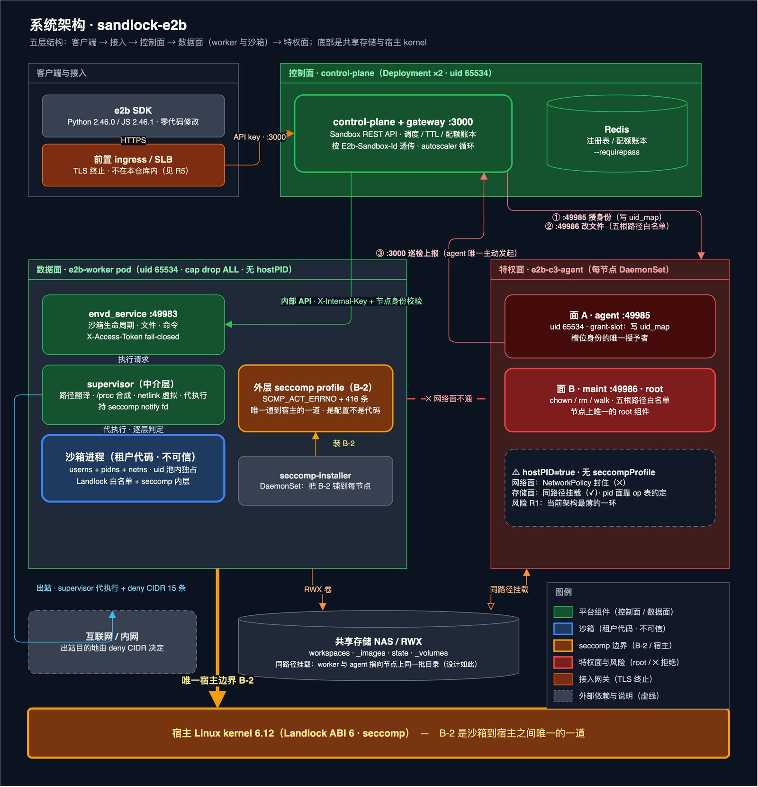

# sandlock-e2b

**E2B 兼容的沙箱服务端**：官方 `e2b` Python / JS SDK **零代码修改**即可接入，运行时用
[Sandlock](https://github.com/imhun/sandlock)（Landlock + seccomp-bpf + seccomp user
notification）在自己机器的 Linux 内核上跑用户代码 —— 不需要 Firecracker，也不需要虚拟化。

## 核心优势

> **一句话**：把 E2B 的开发者体验搬到你自己机房的普通 Linux 服务器上 —— **比容器安全，比 microVM 轻，且不锁定任何云厂商。**

- **无需虚拟化，比 microVM 更轻。** 沙箱是内核原语（userns / pidns / netns + Landlock + seccomp）
  **纵深加固**的进程：没有 guest 内核、没有虚拟化内存开销，普通 Linux 服务器就能跑。
- **换三个环境变量就能迁过来。** 官方 SDK 零代码修改：沙箱、命令与 PTY、文件、卷、快照与 fork、
  暂停/恢复、网络策略、模板构建、MCP 网关全部兼容。
- **沙箱默认只有最小权限，靠多层隔离做纵深防御。** 沙箱内是 root，落到宿主机上只是它**自己的隔离身份**；每沙箱独立的
  PID 与网络命名空间，文件访问受内核级白名单约束，出站必须过策略（默认拒绝直连内网）。
- **平台自己也不能提权。** 执行节点非特权运行、**不带任何特权二进制**，特权动作收拢到每节点一个
  受控组件且只按平台记录执行 —— 攻下一个沙箱也换不到别的租户。
- **生产可用，失败会显式暴露。** 调度、配额、暂停/恢复、快照与 fork、自愈、扩缩容、指标全在仓库内闭环；
  未实现的 API 明确报错，测不到的数值报 `unknown` 而不是 `0`。

**关键读数**（出厂集群 2 节点 arm64，一条命令可复跑）：建箱 p50 **75 / 71 ms**（客户端边界两轮，
2026-10-05 于线上 `0.1.0-1018`）· 平台侧 **41 ms** · **有命令在跑**的沙箱自身进程 **≈16 MiB**
（骨架 ≈12；没跑过命令的空沙箱 **0**，同日复测）· 命令往返 p50 **0.10 s**（内网 0.033 s）· rootfs
解包 **0.26 s**（这两项 2026-10-01 实测）· 沙箱内 `stat` p50 **26 µs**（2026-10-05 复测；均值
口径会被通知限流污染，只看 p50，见 [benchmarks §③](docs/benchmarks.md)）。逐段拆解、复跑口径与历次优化
读数都在 **[docs/benchmarks.md](docs/benchmarks.md)**。

- **兼容面**（协议细节见 [spec.md](spec.md)）：`Sandbox.create/connect/kill`、`commands.run` +
  PTY/stdin、文件 API、`health`/`metrics`/`logs`、Volume、Secret、`pause/resume`、`fork/snapshot`、
  网络策略、模板本地构建、MCP 网关；与 spec 的两处事实性偏差见[文末](#与-spec-的两处事实性偏差)。

## 1. 系统架构

整套系统是**五层**：SDK → 接入 → 控制面 → 数据面 worker（沙箱在这里跑）→ 每节点一个特权 agent
（所有需要特权的杂活收口于此）。底部是共享存储（worker 与 agent 指向节点上同一批目录）和宿主
kernel —— **外层 seccomp profile（B-2）是沙箱到宿主之间唯一的一道**。



> 可编辑源：[system-architecture.drawio](docs/diagrams/system-architecture.drawio) · [SVG](docs/diagrams/system-architecture.svg)；
> 同套图：[部署拓扑](docs/diagrams/deployment-topology.png) · [安全防御分层](docs/diagrams/security-defense.png)。

| 层 | 组件 | 身份 / 端口 | 职责 |
|---|---|---|---|
| 接入 | 前置 ingress / SLB（**不在本仓库内**） | TLS 终止 | HTTPS 终止后转到控制面 `:3000` |
| 控制面 | `control-plane` + gateway（Deployment ×2）+ Redis | `:3000` · uid 65534 | Sandbox REST API：注册表 / TTL / 资源准入 / 配额账本 / 调度；按 `E2b-Sandbox-Id` 透传 Connect-RPC 与 `/files`；autoscaler 循环 |
| 数据面 | `e2b-worker`（StatefulSet） | `envd_service :49983` · uid 65534 · cap drop ALL · 无 hostPID | 沙箱生命周期 / 文件 / 命令（`X-Access-Token` fail-closed）；`supervisor` 做路径翻译、`/proc` 合成、netlink 虚拟与代执行，持 seccomp notify fd；沙箱进程是三重命名空间 + Landlock + seccomp 内层 |
| 特权面 | `e2b-c3-agent`（DaemonSet，每节点） | 面 A `:49985`（uid 65534）/ 面 B `:49986`（root） | 面 A 只写槽位 `uid_map`，面 B 只做 `chown` / `rm` / `walk`，路径必须落在部署显式声明的根之下 |
| 存储与宿主 | NAS（RWX）+ 宿主 kernel 6.12 | — | `workspaces` / `_images` / `state` / `_volumes` 同路径挂载；B-2（416 条 `SCMP_ACT_ERRNO`）铺到每节点 |

调用主干只有一条 **SDK → 接入 → 控制面 → worker**，特权动作是 **控制面 → agent**，agent 反向只有
`:3000` 巡检上报；**worker 与 agent 之间没有网络通道**（NetworkPolicy 只放控制面）。

一次 `Sandbox.create()`（生产形态）：

1. SDK → 控制面 `POST /sandboxes`；调度器选节点、预留配额、登记记录。
2. 控制面 → 目标 worker 的 `POST /agent/sandboxes`（内部 key）；worker 建工作目录
   （`0770 owner=<沙箱 uid> group=<worker gid>`）、挂卷、按需解包镜像 rootfs。
3. 第一条命令触发 **own identity 槽位**：worker fork 的子进程自己 `unshare(CLONE_NEWUSER)` 并上报
   `{sandbox_id, pid}` → 控制面按记录查出 uid → 指令本节点 agent **写 `uid_map`** → 子进程
   `setresuid(X)` 后 exec `sandlock-supervise`。
4. `sandlock-supervise` 在镜像 rootfs（chroot）里按 Landlock/seccomp 策略跑命令，路径中介负责
   网络策略、文件注入、配额记账。

**谁有什么权限**（C3 硬规则，[docs/c3-privilege-relocation.md](docs/c3-privilege-relocation.md)）：

- **worker 零特权**：uid 65534、容器 BND 空集、镜像里没有任何 file-capability 二进制；它能动的是
  "自己作为属组的 `0770` 树"，和"点名一个 sandbox_id 请别人动手"。
- **agent 是唯一的特权组件**：面 A（65534，`SETUID/SETGID` 在 BND 里）只写 `uid_map`；面 B（root，
  `CHOWN/DAC_OVERRIDE`）只做 `chown`/`rm`/`walk`，路径必须在声明的根之下。
- **worker ↔ agent 不存在**：worker 只会拨控制面，控制面才会拨 agent；`envd_service/**` 里不许出现
  agent 的地址/端口/令牌（有单元测试钉住）。

## 2. 隔离边界：三种命名空间

沙箱不是容器也不是 VM —— 它是**一个带 userns / pidns / netns 的进程**，外面再套 Landlock 文件白名单
与 seccomp 过滤器：**userns 管"我是谁"、pidns 管"我看得见谁"、netns 管"我能连谁"，Landlock/seccomp
管"我能碰什么、我能调什么"** —— 四者叠加才是这个沙箱的边界，都由同一份部署清单显式声明。

| 命名空间 | 开关 | 买到什么 |
|---|---|---|
| **userns** | 形态自带（`E2B_PER_SANDBOX_UID`） | 箱内 uid 0 ↔ 宿主侧这个沙箱自己的池 uid；文件属主是池 uid，worker 只是属组（`0770`） |
| **pidns** | `E2B_PID_NS`（部署清单全开，代码默认 `false`） | 箱内看不见宿主与其他沙箱；判据 `kill(<worker pid>, 0)` 共享时 `EPERM`、自有 ns 时 `ESRCH` |
| **netns** | `E2B_ENABLE_NET_ISOLATION` + `E2B_FD_INJECT_CONNECT`（**必须成对**） | 箱内只有 `lo`；出站由 supervisor 接住 `connect()`、在宿主侧建连，再把**已连接的 fd 注入**回来，socket 语义不变 |

- **谁写映射是核心**：子进程自己 `unshare(CLONE_NEWUSER)` 后上报 `{sandbox_id, pid}`，控制面按记录
  查出 uid，指令**本节点 agent** 写 `uid_map`（`E2B_SLOT_IDENTITY=agent-grant`，唯一取值）。
- **开关必须成对**：只开 `E2B_ENABLE_NET_ISOLATION` 会让沙箱变成 loopback-only，故障表现为
  "网络超时"而不是报错，启动期直接拒绝（`NET_ISOLATION_PAIRING_ERROR`）；确实想要不能出网的沙箱
  要显式给 `E2B_NET_ISOLATION_ALLOW_LOOPBACK_ONLY=1`。
- **worker 必须真的跑在我们发的 seccomp profile 下**（`E2B_REQUIRE_SECCOMP_FILTER` 启动时拒绝
  "没有过滤器"的容器），因为沙箱是从 worker 继承 syscall 面的。

完整口径（谁创建、入站与 loopback DNS、pid_ns 的代价与历史缺陷、Landlock/seccomp 分工、
`E2B_ENABLE_NETNS` 遗留旋钮）见 **[docs/isolation-boundaries.md](docs/isolation-boundaries.md)**；
逐项实测见 [docs/benchmarks.md](docs/benchmarks.md) 与 [docs/production-deployment-requirements.md](docs/production-deployment-requirements.md) §2.4。

## 3. 快速开始

配置全量速查见 **[docs/env-vars.md](docs/env-vars.md)**（权威口径是各组件的 `config.py` 与
[spec.md](spec.md) §7.2）。

### 3.1 本地开发（macOS，Local 执行器）

```bash
python3 -m venv tmp/venv
tmp/venv/bin/pip install -r requirements-test.txt
# 终端 1：控制面
E2B_API_KEYS=local-key tmp/venv/bin/python -m control_plane
# 终端 2：envd
E2B_EXECUTOR=local tmp/venv/bin/python -m envd_service
```

```python
import os
os.environ.update(E2B_API_URL="http://localhost:3000",
                  E2B_SANDBOX_URL="http://localhost:49983",
                  E2B_API_KEY="local-key")
from e2b import Sandbox
sb = Sandbox.create()
print(sb.commands.run("python3 -c 'print(1+1)'").stdout)   # 2
sb.kill()
```

macOS 只能跑 Local 执行器（Landlock/seccomp 是 Linux 特性）：协议兼容性可以这样验，
**隔离能力必须换 Linux**；合并形态下 `E2B_API_URL` 与 `E2B_SANDBOX_URL` 可指向同一端口。

### 3.2 容器形态（compose）

```bash
cp deploy/compose/.env.example deploy/compose/.env      # 改密钥/端口/仓库
docker compose -f deploy/compose/docker-compose.prod.yml up -d --build
# 冒烟前抬容量（出厂 E2B_NODE_PROCESSES=256 只放得下 1 个沙箱，否则报 503）：
#   E2B_NODE_MEMORY_MB=4096 E2B_NODE_CPU_PERCENT=400 E2B_NODE_DISK_MB=8192 E2B_NODE_PROCESSES=1024
export E2B_API_URL=http://127.0.0.1:3000 E2B_SANDBOX_URL=http://127.0.0.1:3000 E2B_API_KEY=local-key
python deploy/scripts/multinode_smoke.py      # 跨节点分布 + 命令/文件/stdin + kill 后配额释放
python deploy/scripts/deployment_smoke.py     # 追加：跨 worker 迁移、共享卷隔离、模板构建→registry→worker
```

### 3.3 生产（k0s 集群）

目标集群是**自建 k0s**（2 节点全 arm64，namespace `sandlock`）：

```bash
deploy/scripts/open-cluster-tunnel.sh
export KUBECONFIG="$PWD/tmp/k0s/kubeconfig"      # 任何 kubectl 都要带！
DRY_RUN=1 deploy/k8s-k0s/apply.sh 2>/dev/null | kubectl diff -f -   # 先看差异
deploy/k8s-k0s/apply.sh                                             # 渲染 + apply + 预热 base image
```

⚠ 本机 `kubectl` 的默认 context **不是**这个集群（指向另一套阿里云 ACK），敲写操作前务必先跑上面的
自检。集群身份、入口、上节点方式与历次上线记录都在 [docs/deploy-clusters.md](docs/deploy-clusters.md)。

## 4. 测试与验收

| 层 | 命令 | 环境 |
|---|---|---|
| L1 单元 + L2 契约 | `pytest tests/unit tests/contract` | macOS / Ubuntu |
| L3 Python SDK | `pytest tests/sdk/python` | Linux test runner（Sandlock）；macOS 可用 Local 执行器验协议 |
| L3 JS SDK | `pytest tests/sdk/js` | macOS / Linux（首次 `cd tests/sdk/js && npm install`） |
| L4 安全 | `E2B_BASE_IMAGE=python:3.14-slim pytest tests/security` | 内核 ≥ 6.12（Landlock ABI ≥ 6）+ Docker |
| L5 性能 | `E2B_BASE_IMAGE=python:3.14-slim pytest tests/perf --perf` | Linux + Docker，profile 落 `tmp/perf/` |

```bash
# 容器车道：复现部署形态，而不是 --privileged 的"万能车道"
docker compose -f deploy/compose/docker-compose.test.yml build
./deploy/scripts/test-prod-shaped.sh
```

macOS 宿主只看**容器运行时 VM 的内核**：`python3 -c "import sandlock; print(sandlock.landlock_abi_version())"`
必须 ≥ 6（OrbStack 实测 8，旧 Docker Desktop 常低于该值）。跨平台车道见
[docs/cross-platform-lanes.md](docs/cross-platform-lanes.md)，远端跑 SDK 测试见
[docs/remote-testing.md](docs/remote-testing.md)。**跑车道/构建/部署之前**先看
[docs/build-test-deploy-pitfalls.md](docs/build-test-deploy-pitfalls.md)（"看起来像代码坏了、
其实是环境/流程"的那些坑）。

## 5. 构建与发布

```bash
./deploy/scripts/build-sandlock-wheels.sh     # 先出 wheels/fork/*.whl（不入库）
./deploy/scripts/build-and-push.sh            # 多架构构建 + 推 ACR，版本写进 deploy/stack/.version
export KUBECONFIG="$PWD/tmp/k0s/kubeconfig"
deploy/k8s-k0s/apply.sh                       # 渲染 + apply + 等滚动 + 预热 base image
```

- 版本戳 = `git describe --tags` + 时间戳，k8s 清单按它 pin 每个镜像 tag；镜像有
  `e2b-sandlock-control-plane-gateway`（控制面 + gateway 合并，单端口）、`-worker`、`-agent`、
  `-quota-agent`（可选），**没有 autoscaler 镜像**；升级顺序 **agent → worker**（`apply.sh` 有闸门）。
- 当前线上跑"建箱存储本地优先"布局（沙箱树在节点本地盘、快照是 `fs.tar`），两条操作语义与回退路见
  [docs/deploy-clusters.md](docs/deploy-clusters.md) §7.33，读数见 [docs/benchmarks.md](docs/benchmarks.md)。

## 6. 文档索引

- **入口与现状**：[docs/deploy-clusters.md](docs/deploy-clusters.md)（集群怎么连、历次上线，改部署前必读）·
  [docs/k8s-deployment.md](docs/k8s-deployment.md)（清单逐项、升级/回退、故障）·
  [deploy/k8s-k0s/README.md](deploy/k8s-k0s/README.md) · [docs/env-vars.md](docs/env-vars.md) ·
  [docs/open-issues.md](docs/open-issues.md) / [docs/task-backlog.md](docs/task-backlog.md)
- **设计与形态**：[docs/security-architecture.md](docs/security-architecture.md) ·
  [docs/isolation-boundaries.md](docs/isolation-boundaries.md)（三种命名空间全口径）·
  [docs/c3-privilege-relocation.md](docs/c3-privilege-relocation.md)（特权收口，已实施）·
  [docs/production-deployment-requirements.md](docs/production-deployment-requirements.md) ·
  [docs/security-hardening.md](docs/security-hardening.md) · [docs/tenant-isolation.md](docs/tenant-isolation.md) ·
  [docs/chroot-workspace-exec.md](docs/chroot-workspace-exec.md) · [docs/pure-shape-decision.md](docs/pure-shape-decision.md) ·
  [docs/benchmarks.md](docs/benchmarks.md) · [docs/diagrams/](docs/diagrams)（架构与安全图源）
- **磁盘、配额与扩缩容**：[docs/sandbox-disk-quota.md](docs/sandbox-disk-quota.md) · [docs/disk-quota-options.md](docs/disk-quota-options.md) ·
  [docs/disk-accounting-dirty-dirs.md](docs/disk-accounting-dirty-dirs.md) · [docs/SCALING.md](docs/SCALING.md) ·
  [docs/resource-contention.md](docs/resource-contention.md) · [docs/control-plane-multi-replica.md](docs/control-plane-multi-replica.md)
- **流程与历史**：[docs/build-test-deploy-pitfalls.md](docs/build-test-deploy-pitfalls.md) ·
  [docs/cross-platform-lanes.md](docs/cross-platform-lanes.md) · [docs/remote-testing.md](docs/remote-testing.md) ·
  [docs/reports/](docs/reports)；[docs/HANDOFF.md](docs/HANDOFF.md) 是历史/未实施的记录
- **仓库结构**：`control_plane/`（控制面）、`envd_service/`（每节点 worker）、`c3_agent/`（特权 agent）、
  `quota_agent/`、`autoscaler/`、`gateway_common/`、`deploy/`（Dockerfile、k8s/k0s 清单、compose、脚本）、
  `tests/`、`docs/`、`third_party/sandlock`（fork 子模块，构建 wheel 的源）

## 7. 已知边界

- **Linux only**：Landlock/seccomp 是 Linux 内核特性，macOS 只能跑 Local 执行器；验收环境看容器 VM
  的内核（Landlock ABI ≥ 6，即内核 6.12+）。
- **暂停/快照不是内存快照**：`pause` 冻结进程树；快照与 `fork` 是文件系统级冷启动语义，运行中的
  进程、内存、socket 都不保留。
- **共享卷上的配额靠服务端**：每沙箱磁盘硬限在 NFS 上要由 quota-agent（挂载 XFS 的机器）执行；
  网络文件系统上的 `chown` 只能由 euid 0 做，所以这一步固定在 agent 面 B。
- **控制面默认单写**：多副本要 `E2B_REDIS_URL`，否则注册表/配额在进程内存里。
- **路由与迁移**：同一沙箱同一时刻只在一个节点运行，迁移不搬运运行中的进程；默认布局
  （`E2B_TREES_SHARED=0`）下树在节点本地盘，换机/缩容**先迁走再下线**（`POST /sandboxes/<id>/migrate`）。
- **仓库暂无 LICENSE 文件**：需要声明许可时请补一份。

## 与 spec 的两处事实性偏差

1. **`envdVersion` 用 `0.6.4+sandlock`**：官方 SDK 用 `packaging.Version` 解析该字段，
   `0.6.4-sandlock` 不是合法 PEP 440 版本号，会在 `Sandbox.create()` 时抛 `InvalidVersion`。
2. **SDK 版本**：按 spec 写定的版本测试 —— Python `e2b==2.46.0`（[requirements-test.txt](requirements-test.txt)）、
   JS `e2b@2.46.1`（[tests/sdk/js/package.json](tests/sdk/js/package.json)）；spec 提的 Python `2.46.1`
   **在 PyPI 上不存在**。写这份 README 时（2026-10-01）两侧最新版都是 **2.51.0**，本仓库**未在 2.51 上
   验证**，换版本前先跑 `tests/sdk/python` 与 `tests/sdk/js` 两套。
