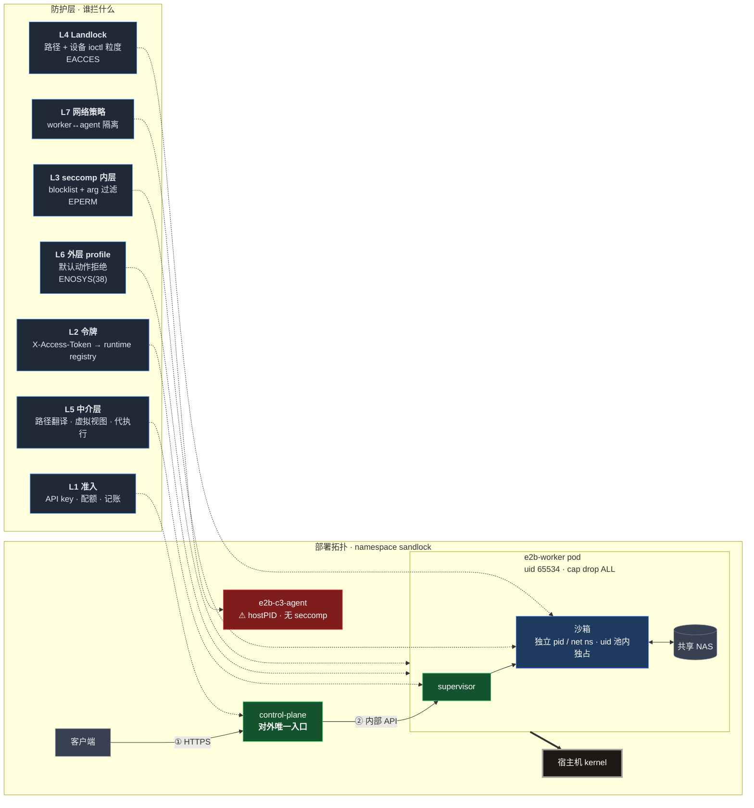

# 安全架构

给要评估这套东西的人看的。深度与逐项证据在
[`security-audit/security-framework.md`](security-audit/security-framework.md)，
那篇是给接手的人查细节用的；这篇只讲这套防线**怎么设计的**、以及它**强在哪**。

一句话：**沙箱与宿主之间没有共享的信任**。四层各自独立执行、互不依赖，
前三层全穿也只到 worker 容器，通到宿主的只有外层一道配置。

## 五个设计选择

### 一、纵深不靠"一层够用"

常见做法是选一个强机制（Landlock 或 seccomp）然后赌它没漏。这里是五层各自执行，
每层解决不同性质的问题：准入（谁能来）、令牌（来了能干什么）、seccomp（能不能发起
特权 syscall）、Landlock（能不能碰这个路径）、中介（语义上该不该放行）。

层与层之间**不互相假设**。实测里最有说服力的一次：内层 seccomp 已经挡住
`fchmodat2` 了吗？没有 —— 挡住它的是外层 profile，而外层一换就漏。六层里
任何一层单独被绕过，上面还有别的。

### 二、fail-closed 是默认值，不是选项

Landlock 的保护默认 `strict_all()`：内核 ABI 够不着就**拒绝建箱**，不静默降级。
只有显式标成 `Degradable` 的保护才会悄悄丢掉对应的 mask 位。

令牌守卫同构 —— 早期版本是 `if runtime.access_token and token != ...`，
空 token 时**恒真**（整个逃逸的根因）。现在是
`if not runtime.access_token or token != ...`：拿不到 token 一律拒。

这类"默认宽松、需要显式收紧"的地方在这套设计里被系统性排除了。

### 三、隐藏信息用合成，不用拒绝

netlink 和 `/proc/net/*` 都不是"拒绝访问"，而是**返回生成的内容**：
`/proc/net/dev` 永远只列 loopback，netlink 的接口转储由 supervisor 合成。
`AF_NETLINK` / `NETLINK_ROUTE` 照常建得起来，`getifaddrs()` 和 `if_nameindex()`
照常能用 —— 但里面没有宿主接口名。

对比一刀切拒绝的方案：后者会让 `ip addr`、`if_nameindex()`、大量运行时和测试框架
在沙箱里直接报错。合成视图把"看不见"和"不能用"分开了。

同一个沙箱里两条信道口径可能不同（netlink 跟 `net_isolation` 走，
`/proc/net/dev` 无条件 loopback-only），这点在实现里记着，因为拿它们互相印证会量错。

### 四、每层拒绝有独特指纹

排障时能立刻定位到是哪一层拒的：

| 指纹 | 来自 |
|---|---|
| `EPERM` | 内层 blocklist |
| `ENOSYS(38)` | 外层 profile 的默认动作 |
| `EACCES` | Landlock |
| `EAFNOSUPPORT` | 中介层的语义拒绝（沙箱化的正常报错，不是权限） |
| `EOPNOTSUPP` | 中介层的路径语义 |

最后两个尤其重要：`EAFNOSUPPORT` 用的正是内核对未知 family 的标准码，
所以沙箱里的报错和"平台真的不支持"无法区分，不会把正常错误读成权限事件。

### 五、同一个属性由两道独立机制守

隐藏宿主接口名靠 **netlink 合成 + `SIOCGIF*` ioctl deny list**。
两者互不暗示 —— 这是它的风险，也是它的价值：删掉一个，另一个还在，
而且"删掉这个是不是多余"这个念头本身就说明注释写得不够。

同样的做法用在几处：终端写入族不加 deny，靠"每沙箱独立 devpts 实例 +
`/dev/tty` 打不开 + 沙箱内同 uid"三个前提；前提被破坏时测试变红，
提醒该把 deny 加回去。

## 能力边界

按"沙箱够不够得到"分，不按严重度 —— 后者会把打不到的东西排到前面。

**够不到，根子在内核**：节点 kernel `6.12.0-211` 未打
CVE-2026-53362（IPv6 分片堆溢出，CISA KEV 已确认在野利用）。触发原语实测可达，
沙箱的 seccomp 与 Landlock 都挡不住内核里的算术错误 —— 只有升级到 6.12.95+ 能挡。
公开 exploit 是 x86_64-only 且要求五级页表，在 arm64 节点上跑不起来，
但那是利用链的缺失，不是漏洞的缺失。

**够得到，已挡，但机制是巧合**：`AF_RXRPC`（另一个 KEV LPE 的面）
当前同时被 socket 白名单和"模块恰好没加载"挡住，只有前者是策略。

**架构级已知项**：平台面无租户隔离（一个 API key 管所有沙箱）；
共享 workspace 形态下磁盘配额不生效；c3-agent 没有 syscall 过滤，
只靠一条 NetworkPolicy。

**没做的**：跨切面冒烟没跑（验证面是 syscall 面与鉴权面，冒烟不覆盖这两者）。

## 怎么验证的

不是读代码得出的结论。每条都跑在真实部署上，包括集群外零凭据的端到端尝试。

门禁跟着层走：fork 的 syscall/socket 面有单元测试，envd 鉴权、
特权文件步、宿主接口名各有对应的测试文件；需要真实沙箱车道的
（`tests/security/`）**没跑就是没跑**，不用别的套件绿了充数。

有几处专门防"本地绿 ≠ 生产"：每个 protection 的 ABI floor 与**线上实测的**
Landlock ABI 对照钉住（当前线上 6，六个 floor 最高也是 6，无降级），
而本地车道是 8。

## 深入阅读

| 想看 | 去哪 |
|---|---|
| 每层机制、代码位置、门禁清单 | [`security-audit/security-framework.md`](security-audit/security-framework.md) |
| 逐轮审计记录与证据矩阵 | `security-audit/findings*.md` |
| 分层归因（哪些只靠外层挡） | `security-audit/layer-attribution-2026-10-04.md` |
| 已修的高危项与修法 | `security-audit/remediation-SEC-R3-01.md` |
| 加固历史 | [`security-hardening.md`](security-hardening.md) |
| 部署形态与上线记录 | [`deploy-clusters.md`](deploy-clusters.md) |