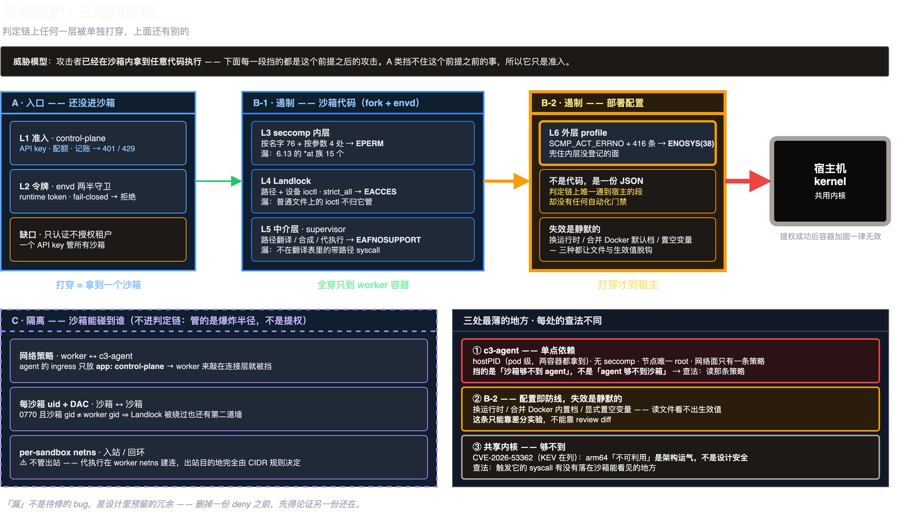
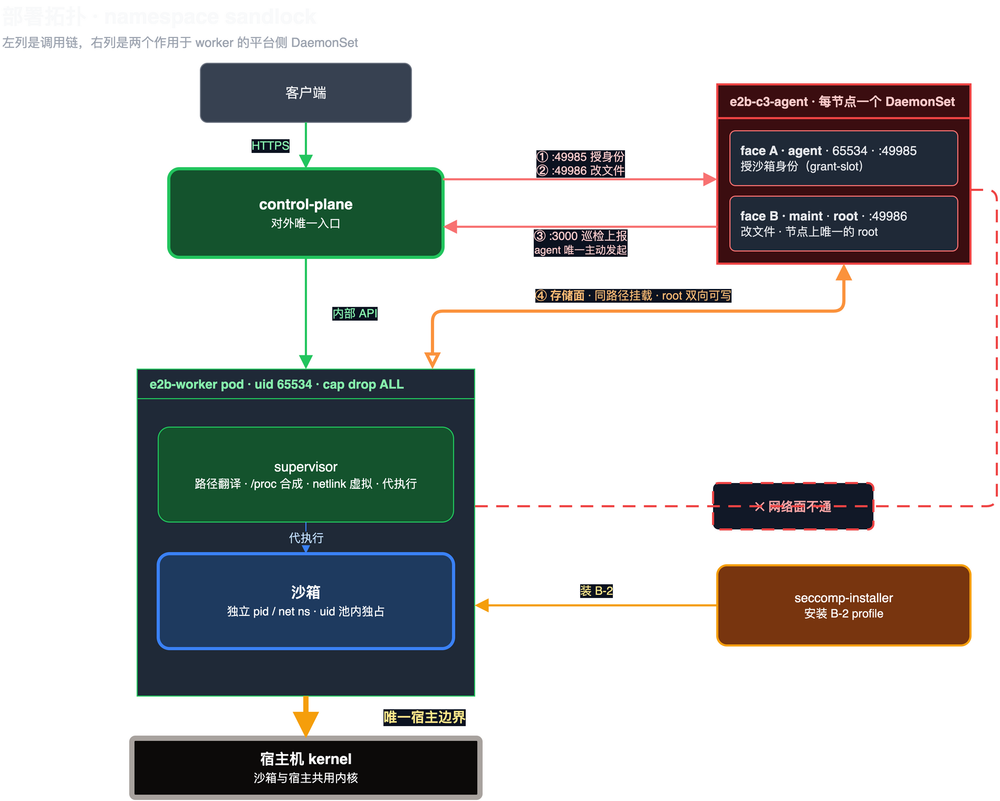

# 安全架构

**文档类型**：系统安全架构说明（系统方案架构设计师视角）
**读者**：架构评审 / 立项评审 / 甲方安全评审，以及新接手的安全与平台负责人
**回答四个问题**：① 系统边界在哪；② 信任边界在哪、有几道；③ 每条安全需求由**哪个组件的哪个机制**满足、怎么验；④ 还剩什么风险、为什么敢留着
**不回答**：逐条 syscall 读数、审计轮次、修复 diff —— 那些在证据文档里（见[深入阅读](#深入阅读)）

**事实基准**：2026-10-04 / 10-05 自建 k0s 集群实测（2 节点 arm64、kernel `6.12.0-211.34.1.el10_2`、containerd 2.3.4、Rocky 10.2、namespace `sandlock`、部署版本 `0.1.0-979`）。本文所有结论要么有实测读数，要么有代码/清单位置；两者都没有的标成推测。

---

## 0. 摘要：给评审的一页

### 0.1 一句话

**沙箱与宿主之间不共享任何信任**：判定链上任何一层被单独打穿，上面还有别的层；而通到宿主的**只有最外层一道部署配置**。

### 0.2 三个设计支点

1. **纵深不是"层多"，是"各层解决不同性质的问题"**。seccomp 问"能不能发起这个 syscall"、Landlock 问"能不能碰这个路径"、中介层问"语义上该不该放行"、外层 profile 问"有没有登记在内层清单里"。层与层之间不互相假设——内层 seccomp 挡不住 `fchmodat2`，挡住它的是外层 profile，而外层一换就漏。这是**实测**，不是推理。
2. **唯一宿主边界是可识别、可点名的**：`deploy/seccomp/sandlock-worker.json`（416 条）。打穿它上面的三层只到 worker 容器，打穿它才到宿主 kernel。整套架构的可推理性来自这个换算。
3. **特权集中到一个可枚举的组件**：worker 零特权（uid 65534、BND 空集），节点上唯一的 root 是每节点一个的 c3-agent 面 B，且它的路径被五根白名单钉死。特权面从"很多进程都有"收敛成"一张表"。

### 0.3 必须主动讲的残余风险（不是被问到才说）

| # | 残余风险 | 为什么现在能接受 | 什么时候不能接受 |
|---|---|---|---|
| R1 | c3-agent `hostPID=true` + **无 seccompProfile**，唯一 root 组件，隔离只靠一条 NetworkPolicy | 方向是"沙箱从下面够上来"，网络面在连接层已封；存储面有五根路径白名单；pid 面靠 op 表约定 | 任何"给 worker 加一条 agent 直连"或"放宽那条 NetworkPolicy"的改动 |
| R2 | B-2（外层 profile）**没有自动化门禁**，是配置不是代码，失效是静默的 | 改动频率极低，且有差分实验方法 | 换运行时、升内核、改这份 JSON 之后只 review diff 不实测 |
| R3 | 共享内核：CVE-2026-53362（KEV 在列）节点内核未打补丁 | 当前 arm64 上"可触发、不可利用"（公开 exploit 需 x86_64 LA57）；阻断点在网络策略层 | 部署到 x86_64，或内核升级窗口，或 deny 清单被显式置空 |
| R4 | 租户隔离（OBS-6）：能力已完整落地但**默认关闭** | 未配置 `E2B_TENANTS` 即单租户兼容模式，出厂示例没这个变量 | 任何多租户上线场景——**必须在部署配置里打开，不是改代码** |
| R5 | 入口 TLS 依赖前置代理：仓库内 NodePort 入口不带 TLS | 集群外由 SLB/ingress 承担 | 前置代理未就位时 API key 与沙箱数据明文过网 |

### 0.4 结论的适用边界

本文的安全结论建立在 **syscall 面与鉴权面的实测**上。跨切面冒烟（multinode 与 deployment 两条）已于 2026-10-05 补跑通过，但**冒烟不覆盖这两个面**；而**"没找到证据"不等于"确认安全"**——这句话在本文各节反复出现，是有意的。

---

## 1. 视图 1：系统上下文 —— 系统边界与安全需求

### 1.1 系统是什么

一个 **E2B 兼容的托管沙箱即服务**：客户端用官方 SDK 创建/操作沙箱，平台在共享内核的 Linux 节点上以受限进程的形态运行租户代码。它**不是 VM 池，也不是容器编排层**——沙箱是"一个带 userns / pidns / netns 的进程，外面套两层内核过滤器"。

这个定义决定了全部安全代价：**共享内核换来零设备模拟与原生兼容性，代价是遏制必须来自 syscall 面与部署配置，而不是另一个内核。**（取舍见[§9 决策 D1](#d1-共享内核-vs-虚拟化执行层)）

### 1.2 参与者与初始信任假设

| 参与者 | 信任假设 | 假设失效时由谁兜 |
|---|---|---|
| 客户端 SDK / 调用方 | 持有合法 API key | A 类准入（401/429） |
| **沙箱内的租户代码** | **完全不可信，且已拿到任意代码执行** | B 类遏制 + C 类隔离 |
| 平台运维 | 可信，凭据由 Secret + runbook 管理 | 本文范围外（运维面） |
| 集群 / 内核 / 存储 | 可信基座 | 本文范围外，但见[§8.1 能力边界](#81-能力边界系统够不到的地方) |

**威胁模型只针对第二行**，见 [§7](#7-威胁模型)。

### 1.3 系统外的依赖与安全契约

| 外部依赖 | 提供什么 | 系统对它的安全契约 |
|---|---|---|
| k0s 集群（2 节点 arm64） | 调度、NetworkPolicy、Pod Security | NetworkPolicy **必须被 CNI 真实执行**（calico）；pod 级字段（`hostPID`）是信任边界的载体 |
| 宿主 kernel 6.12 | Landlock ABI 6、seccomp、namespace | 六项 Landlock 保护的 floor ≤ 6 ⇒ 线上无降级；内核 CVE 属于能力边界 |
| RWX 存储（NFS / 本地盘） | 工作区、镜像缓存、状态 | NFS `chown` 只认 euid 0 ⇒ 特权被固定在 agent 面 B（这是**约束特权位置**，不是放松特权） |
| Redis | 多副本注册表与配额账本 | 必须带 `--requirepass`（P0-2 已修）；凭据来自 Secret |
| 镜像源 / OCI registry | 镜像拉取 | digest 固定 + 本地 registry 预置（供应链项，见 `production-deployment-requirements.md` §2.6） |
| 前置 ingress / SLB | **传输机密性（TLS）** | **仓库内不提供**——NodePort 31907 是明文，这是 R5 |

### 1.4 安全需求清单（SR）

需求从威胁模型与外部契约导出，编号在 [§2.3 覆盖矩阵](#23-需求覆盖矩阵)里被引用。

| ID | 安全需求 | 来源 |
|---|---|---|
| SR-01 | 只有持有效凭据的调用方能创建与驱动沙箱 | 准入 · L4 |
| SR-02 | 租户只能看到、操作自己的资源（列表过滤 + 归属校验 + 跨资源一致） | 多租户业务要求（OBS-6） |
| SR-03 | 平台内部每条通道独立鉴权、fail-closed | 纵深 / 历史逃逸根因 |
| SR-04 | 沙箱内代码不能发起特权 syscall（提权阻断） | L1 |
| SR-05 | 沙箱内代码不能读写其工作区之外的路径 | L1 / L2 |
| SR-06 | 沙箱内代码不能获知宿主拓扑（接口名、宿主进程、真实 `/proc/net`） | L3 / 信息泄露 |
| SR-07 | 沙箱出站目的地受控；入站与回环不构成横向通路 | L2 / L3 |
| SR-08 | 沙箱之间不能互相读写（即使某一层被绕过） | L2 |
| SR-09 | 沙箱够不到控制面与特权 agent | L3 |
| SR-10 | 特权集中、可枚举、路径受限 | 纵深 / blast radius |
| SR-11 | 单租户的资源消耗不能打垮共享节点或挤占其他租户 | L4 |
| SR-12 | 凭据受保护、可轮换、落盘加密 | 运维面 + 数据保护 |
| SR-13 | 传输机密性（客户端↔平台） | 数据保密性 |
| SR-14 | 每次拒绝可归因到具体控制层，且有自动化门禁 | 可验证性（本文全部结论的前提） |

---

## 2. 视图 2：逻辑 —— 安全能力模型

### 2.1 三类控制，各管一件事

防线不是按层平铺，而是**三类**。混在一张表里看会误以为"再多加一层就更安全"：

| 类 | 回答的问题 | 含哪些手段 | 失效意味着 | 对应需求 |
|---|---|---|---|---|
| **A 入口控制** | 攻击者**还没进沙箱**时，谁有权让他进 | API key · 配额 · 记账 · `X-Access-Token` → runtime registry | 拿到一个不该拿到的沙箱 | SR-01 / SR-11 |
| **B 遏制控制** | 已经在沙箱里的代码**能干什么** | seccomp 内层 · Landlock · 中介层 · 外层 profile | 沙箱内提权 / 读到不该读的面 | SR-04 / SR-05 / SR-06 |
| **C 隔离控制** | 沙箱**能碰到谁**（爆炸半径） | NetworkPolicy · 每沙箱 uid + DAC · per-sandbox netns · deny CIDR | 横向到别的沙箱或平台面 | SR-07 / SR-08 / SR-09 |

**三类里只有 B 挡得住威胁模型的前提**（攻击者已在沙箱内）。A 属于准入，C 属于爆炸半径——**A 不在这条判定链上**：准入被绕过不产生"沙箱内提权"，产生的是"拿到了别人的沙箱"，那是 C 要管的事。

### 2.2 判定链：为什么 B-2 是唯一宿主边界

B 类内部按**谁来执行**折成两段：

```
A 入口  →  B-1 沙箱代码（fork + envd）  →  B-2 部署配置  →  宿主 kernel
拿到一个沙箱        全穿只到 worker 容器        打穿才到宿主
```



| 段 | 手段 | 拦什么 | 谁执行 | 拒绝指纹 |
|---|---|---|---|---|
| B-1 | seccomp 内层：blocklist 76 条 + arg 过滤 4 处（`clone` 的 `CLONE_NEW*`、`socket` 的 `SOCK_RAW`/`SOCK_DGRAM`、`ioctl` 的 20 个请求码、`prctl` 的 3 项） | 能不能发起特权 syscall | 沙箱进程 | `EPERM` |
| B-1 | Landlock：六项保护，`strict_all()` | 能不能碰这个路径 | 沙箱进程 | `EACCES` |
| B-1 | 中介层：路径翻译 / procfs 合成 / netlink 虚拟 / 代执行 | 语义上该不该放行 | supervisor | `EAFNOSUPPORT` / `EOPNOTSUPP` |
| **B-2** | 外层 profile：`SCMP_ACT_ERRNO` + 416 条允许项 | 兜住内层没登记的面 | **worker 容器（部署配置）** | `ENOSYS(38)` |

这个换算是整套架构可推理的来源：

- **B-1 在仓库里** —— 可单元测试、每次改动有 diff、能进 CI。
- **B-2 是一份 416 条的 JSON** —— 失效模式是"换了运行时就没了"（实测：`seccomp=unconfined` 下 7 个 `*at` syscall 全部到达内核；Docker 内置默认档放行 `fchmodat2`）。
- 所以"**改哪一段会破什么**"是可回答的，而 B-2 是唯一值得当边界看的那段。

图上三段箭头的**粗细就是后果严重程度**，每段内部都标了自己**漏什么**——这不是"层越多越安全"的清单，而是"每层都有已知缺口，靠别的层兜"。**漏不是待修的 bug，是设计里预留的冗余。**

### 2.3 需求覆盖矩阵

架构评审的核心表：每条需求都能指到**承载组件**与**验证手段**。

| 需求 | 承载控制 | 承载组件 / 位置 | 验证手段 | 状态 |
|---|---|---|---|---|
| SR-01 准入 | API key + 配额 + 创建限流 | `control_plane`（401 / 429） | 合同测试 + 限流测试 | ✅ |
| SR-02 租户授权 | `tenant_of` / `_require_owned` / `_require_related`、`E2B_TENANTS` | `control_plane/auth.py` | `tests/contract/test_tenant_isolation.py` | ⚠️ **能力已落地、默认关闭**（R4） |
| SR-03 通道鉴权 | `X-Internal-Key` + 节点身份（地址/源 IP）· `X-Access-Token` · `E2B_C3_AGENT_TOKEN` · `E2B_REDIS_PASSWORD` · `E2B_QUOTA_AGENT_TOKEN` | CP / envd 两半守卫 / agent / redis / quota | `test_envd_token_fail_closed.py`（**fail-closed**：拿不到 token 一律拒） | ✅ |
| SR-04 特权 syscall | seccomp 内层 + 外层 profile | `third_party/sandlock`（fork）+ `deploy/seccomp/sandlock-worker.json` | `cargo test -p sandlock-core --lib`；B-2 见[§3.4](#34-门禁空缺) | ✅ / B-2 ⚠️ |
| SR-05 路径隔离 | Landlock 六项 + 中介层路径翻译 | `landlock.rs` / `protection.rs` + supervisor | `protection.rs` 的 `*_deployed_abi`（线上 ABI 6 = 六项 floor 上限 ⇒ 无降级） | ✅ |
| SR-06 信息隐藏 | netlink 合成 + `/proc/net/*` 合成 + `SIOCGIF*` ioctl deny | supervisor / envd | `test_socket_families.py` · `test_ioctl_inventory.py` | ✅（**两道腿，删一道另一道还在**） |
| SR-07 网络边界 | per-sandbox netns（入站/回环）+ 代执行 + deny CIDR 15 条 | `gateway_common/network.py` · `network/rules.rs` · `network/mod.rs` | `test_network_deny_bypass.py` + 差分实验 | ✅（netns **不管出站**，见[§5.4](#54-共享面与非隔离处设计如此)） |
| SR-08 沙箱互隔 | 每沙箱 uid（10000+ 起）+ `0770`（owner=沙箱 uid、group=worker gid 65534，**沙箱 gid 永不等于 worker gid**） | `uid_pool.py` + agent 面 A 授身份 | 双沙箱互攻用例（10001 vs 10002） | ✅（Landlock 被绕过也还有 DAC 这道墙） |
| SR-09 平台面隔离 | agent 的 NetworkPolicy（`ingress` 仅 `app: control-plane` × 2 端口）+ token 不进 worker | `deploy/k8s/c3-agent.yaml` | 清单 review + 连接层实测 | ⚠️ **单点**（R1） |
| SR-10 特权集中 | worker BND 空集；唯一 root = agent 面 B；五根路径白名单 | `deploy/k8s/worker.yaml` · `c3-agent.yaml` · `priv_common.c` | `test_priv_maint_worker_gate.py` · `test_worker_manifest_permissions.py` | ✅ |
| SR-11 资源闸 | 全局配额 + 创建限流 + 磁盘/内存/进程/输出四维 | `process/manager.py` · registry 配额账本 | 四维实测；六条写路径实测停在天花板 | ✅ |
| SR-12 凭据 | Secret 存储 + Fernet 落盘（`E2B_SECRET_MASTER_KEY`）+ 轮换 runbook | `e2b-secrets` · `docs/k8s-deployment.md` §4.5/§4.6 | 指纹对账（只读） | ✅ |
| SR-13 传输机密性 | **前置 ingress/SLB 的 TLS** | 集群外 | — | ⚠️ **仓库内不提供**（R5） |
| SR-14 可归因 | 五组互不重叠的 errno 指纹 + 差分实验 | 各层 | 见 [§10](#10-验证合规与证据) | ✅ / B-2 ⚠️ |

### 2.4 五条设计原则

这五条是本方案区别于"选一个强机制然后赌它没漏"的地方：

1. **纵深不靠"一层够用"**。各层解决不同性质的问题，层间不互相假设。证据是不对称且可测的：内层 seccomp 挡不住 `fchmodat2`，Landlock 挡不住内核算术错误，外层 profile 换个运行时就没了 ⇒ **任何一层的强度都不足以单独承担边界**。
2. **fail-closed 是默认值，不是选项**。Landlock 够不着就**拒绝建箱**，不静默降级；令牌守卫是 `if not runtime.access_token or token != ...`（早期版本空 token 恒真，是整个逃逸的根因）；worker 缺外层 profile **起不来**（这是 fail closed，不是 flake）。"默认宽松、需要显式收紧"的形态被系统性排除。
3. **隐藏信息用合成，不用拒绝**。`/proc/net/dev` 永远只列 loopback、netlink 的接口转储由 supervisor 生成 ⇒ `ip addr`、`getifaddrs()`、`if_nameindex()` 照常能用，但里面没有宿主接口名。一刀切拒绝会让大量运行时与测试框架直接报错——合成把"看不见"和"不能用"分开了，**零功能代价**。
4. **同一属性由两道独立机制守**。隐藏宿主网卡名 = netlink 合成 + ioctl deny；文件隔离 = Landlock + 每沙箱 uid DAC。两道互不暗示 ⇒ **删掉一个之前必须先论证另一个还在**，这正是把冗余写进注释与测试的目的，也带来"改动通常不需要新的安全论证"这个反直觉性质。
5. **拒绝可归因**。每层拒绝有独特指纹（见下表），差分实验能把"哪一层拒的"变成读数而不是推理。副作用同样重要：中介层用内核标准错误码表达"这件事被沙箱化了"，于是沙箱里的正常报错不会被监控读成权限事件。

| 指纹 | 来自 |
|---|---|
| `EPERM` | 内层 blocklist |
| `ENOSYS(38)` | 外层 profile 默认动作（**运行时给的读数，不是文件里写的**） |
| `EACCES` | Landlock |
| `EAFNOSUPPORT` | 中介层语义拒绝（= 内核对未知 family 的标准码） |
| `EOPNOTSUPP` | 中介层路径语义 |

---

## 3. 视图 3：开发 —— 代码、配置与门禁

### 3.1 资产分层：哪些是代码，哪些是配置

这个分层决定"安全性靠什么维持"：

| 层 | 资产 | 变更方式 | 安全性如何维持 |
|---|---|---|---|
| **代码**（B-1 主体） | `third_party/sandlock`（fork：seccomp / landlock / procfs / netlink / network）、`envd_service`、`control_plane` | PR + diff + CI | 单元测试与合同测试 |
| **部署配置**（B-2 + C 类） | `deploy/seccomp/sandlock-worker.json`、`deploy/k8s/*.yaml`（worker / c3-agent / NetworkPolicy）、`E2B_NETWORK_DENY_CIDRS` | 改清单再 apply | **⚠️ 门禁薄弱，见 §3.4** |
| **运行时配置**（A 类） | `E2B_API_KEYS`、`E2B_TENANTS`、`E2B_INTERNAL_API_KEY`、Secret | 环境变量 / Secret | fail-closed 测试 + 部署验收清单 |

### 3.2 配置资产清单（评审时该点名看的）

| 资产 | 内容 | 失效模式 |
|---|---|---|
| `deploy/seccomp/sandlock-worker.json` | B-2：`SCMP_ACT_ERRNO` + 416 条 | **换运行时即失守**；合并行为随运行时变化（compose 车道上 Docker 会并入自己的内置默认档，`statmount` 就是例子） |
| `envd_service/config.py::DEFAULT_NETWORK_DENY_CIDRS` | 15 条拒绝 CIDR，含 `0.0.0.0/8` 与 `::1/128` | **显式置空即关闭整个保护**（设计如此）；旧清单部署没有 `::1` 那道（SEC-001 的根因） |
| `deploy/k8s/c3-agent.yaml` 的 NetworkPolicy | `ingress` 只有一个 `from`（`app: control-plane`）+ 两个端口 | **一个策略变更就打通**（R1） |
| `deploy/k8s/worker.yaml` | `runAsUser/runAsGroup: 65534` 显式 pin、`drop: [ALL]` 无 `add`、`Localhost` seccomp、**无 `hostPID`** | 只靠镜像 `USER` 会被读成"未知"；**不要给 worker 加 `no-new-privileges`**（agent 面 A 靠 file capabilities 写 `uid_map`，NNP=1 会让它静默失效） |
| `E2B_TENANTS` / `E2B_ADMIN_API_KEYS` | 租户归属与管理员 key | **未配置 = 单租户兼容模式**（R4） |

### 3.3 门禁映射：改什么跑什么

| 改什么 | 属于 | 跑什么 |
|---|---|---|
| fork 的 syscall 面 | B-1 | `cargo test -p sandlock-core --lib`（除 2 个环境项外全绿） |
| fork 的 socket / netlink 面 | B-1 | 同上 + `test_socket_families.py`（需沙箱车队） |
| Landlock 保护或 floor | B-1 | 同上 + `protection.rs` 的 `*_deployed_abi` |
| envd 鉴权 | A | `test_envd_token_fail_closed.py` |
| c3 特权面 | C | `test_priv_maint_worker_gate.py` |
| 宿主接口名 | B-1 | `test_ioctl_inventory.py` |
| 租户归属 / 授权 | A | `tests/contract/test_tenant_isolation.py` |
| worker 权限清单 | C | `tests/unit/test_worker_manifest_permissions.py` |
| **外层 profile 本身** | **B-2** | **没有单元测试 —— 见下** |

`tests/security/` 需要真实沙箱车队，**没跑就是没跑**，不用别的套件绿了充数。本地车道 Landlock ABI 是 8、线上是 6，所以每个 protection 的 floor 都与**线上实测 ABI** 对照钉住——这是专门防"本地绿 ≠ 生产"的一类测试。

### 3.4 门禁空缺

**判定链上唯一通到宿主的那一段（B-2）没有任何自动化门禁。** 它只能靠差分实验加人工读。

> 处置规则：`sandlock-worker.json` 的任何改动都应该配一次实测读数（同一探针在 profile ON/OFF 各跑一遍），而不是只 review diff。这是 R2 的**验证方式**，不是缓解措施。

---

## 4. 视图 4：运行时 —— 进程与权限分布

### 4.1 组件权限矩阵

评审时最该看的一张表：**谁是 root、谁不是、凭什么**。

| 组件 | 形态 | uid | capabilities | seccomp | hostPID | 备注 |
|---|---|---|---|---|---|---|
| control-plane + gateway | Deployment（2 副本）| `65534` 显式 pin | — | — | 未设 | 对外唯一入口 `:3000`；单写需 Redis |
| redis | Deployment | — | — | — | 未设 | `--requirepass` |
| **e2b-worker** | StatefulSet（2 副本） | `65534` 显式 pin | **`drop: [ALL]`，无 `add`（BND 空集）** | `Localhost`（= B-2） | **未设** | 含 envd `:49983` + supervisor（持 seccomp notify fd） |
| 沙箱进程 | worker 内的受限进程 | 池内独占 uid（10000+ 起） | 继承容器的空集 BND | 内层 seccomp + 外层 profile | — | 独立 userns / pidns / netns；`$$`=3 |
| **c3-agent 面 A** `agent` | DaemonSet 内容器 | `65534` | BND 含 `SETUID/SETGID`（file capabilities） | **无** | **`hostPID: true`（pod 级）** | `:49985` `grant-slot`：写 `uid_map`，槽位身份的唯一授予者 |
| **c3-agent 面 B** `maint` | 同 pod 内容器 | **root** | `CHOWN` / `DAC_OVERRIDE` / `FOWNER` | **无** | 同上 | `:49986` `chown`/`rm`/`walk` + `materialize`（NFS AUTH_SYS 只认 root 做 chown） |
| seccomp-installer | DaemonSet | — | — | — | 未设 | 把 B-2 写到每节点 kubelet seccomp 根 |

### 4.2 命名空间与隔离单元

沙箱不是容器也不是 VM，而是**三层命名空间 + 两层过滤器**：

| 隔离单元 | 谁创建 | 买到什么 | 明确**不**买到什么 |
|---|---|---|---|
| userns | 沙箱子进程 `unshare(CLONE_NEWUSER)`，**由 agent 写 `uid_map`** | 身份翻译 | **不是隔离**——它只决定 uid 映射 |
| pidns（`E2B_PID_NS=true`） | worker | 沙箱看不见宿主与别人的进程 | 证据取自 pod 规格与 `$$`，**不取自沙箱内 `/proc` 的数字目录数**（实测恒为 0，那是"看不到"不是"不存在"） |
| netns（per-sandbox） | worker | **入站与回环**隔离、每沙箱自己绑 `:53` | **不管出站**——出站在 worker netns 里由 supervisor 代建连 |
| Landlock（文件） | 沙箱进程 | 路径 + 设备 ioctl 粒度 | 不覆盖普通文件上的 ioctl（靠 seccomp arg 过滤补） |
| seccomp（syscall） | 沙箱进程 + 容器 | 特权 syscall 与参数 | 不看 fd 类型 ⇒ 拿不到"这个 splice 的目标是不是数据报 socket" |

### 4.3 特权收敛的三条硬规则（C3）

1. **worker 零特权**：uid 65534、BND 空集、镜像里没有任何 file-capability 二进制。它能动的是"自己作为属组的 `0770` 树"，和"点名一个 sandbox_id 请别人动手"。
2. **agent 是唯一的特权组件**：面 A 只写 `uid_map`，面 B 只做文件操作，且路径必须落在部署显式声明的根之下。
3. **寻址方向不可反，worker ↔ agent 不存在这条通道**：worker 只拨控制面，控制面才拨 agent。`envd_service/**` 里不许出现 agent 的地址/端口/令牌——**有单元测试钉住**。CP 通过「worker pod → `spec.nodeName` → 该节点上的 agent pod」三跳解析出**它自己算出来的**地址，指令体里的地址永远不是 worker 报的；`E2B_C3_AGENT_TOKEN` 不在任何 worker manifest 或镜像里（一个能读到它的 worker 就等于事实上的 `worker → agent` 通道）。

---

## 5. 部署视图：拓扑与信任边界

### 5.1 拓扑



调用链：`客户端 —HTTPS→ control-plane —内部 API→ worker pod`。图上最粗的那条线是**唯一宿主边界**：它的下方就是宿主 kernel，它的上方全穿也只是 worker 容器。

### 5.2 信任域

| 域 | 含什么 | 信任级别 | 跨越方式与控制 |
|---|---|---|---|
| T0 客户端 | SDK / 调用方 | 不可信（凭据可信） | `X-API-Key` + 前置 TLS（R5） |
| T1 平台入口 | control-plane + gateway `:3000` | 可信 | API key、配额、创建限流 |
| T2 平台内部服务 | redis · buildkit（compose 车道，仅 unix socket）· quota-agent（当前 k8s 清单未部署） | 可信（限权） | `X-Internal-Key` / `E2B_REDIS_PASSWORD` / `E2B_QUOTA_AGENT_TOKEN`；**secret 落盘 Fernet 加密** |
| T3 数据面 worker | worker 容器（envd + supervisor） | **低特权、非 root** | `X-Internal-Key` + 节点身份校验（地址/源 IP） |
| T4 沙箱 | 租户代码 | **完全不可信** | B 类遏制（内层 seccomp / Landlock / 中介）+ C 类隔离 |
| T5 特权 agent | c3-agent 面 A / 面 B | **高特权、单点** | CP 专用 token + NetworkPolicy + 五根路径白名单 |
| T6 宿主 | kernel + 节点 | 可信基座 | **B-2 外层 profile —— 唯一一道** |

**跨越 T4→T6 只有一条路，且它是一份 JSON。** 这是整张图最需要记住的一格。

### 5.3 具名通道清单

| 通道 | 方向 | 端口 | 鉴权 | 干什么 |
|---|---|---|---|---|
| 客户端 → 控制面 | 入站 | `:3000`（NodePort 31907 / gateway Service 49983→3000） | API key + 前置 TLS | REST / Connect-RPC / `/files` |
| 控制面 → worker | 内部 | `:49983`（envd） | `X-Internal-Key` + 节点身份 | 建箱、命令、文件、沙箱生命周期 |
| 控制面 → agent 面 A | 内部 | `:49985` | `E2B_C3_AGENT_TOKEN` | `grant-slot`：反查 pid、写 `uid_map` |
| 控制面 → agent 面 B | 内部 | `:49986` | 同上 | `chown` / `rm` / `walk` / `materialize` |
| agent → 控制面 | 上行 | `:3000` | 同上 | 巡检上报（agent **唯一主动发起**的连接） |
| 沙箱 → 沙箱外网络 | 出站 | 任意 | **目的地由 deny CIDR / allow 规则决定** | supervisor 在 **worker netns** 代建连 |
| 沙箱内 MCP 端口带 | worker 节点内 | `61001–65535` | —（隔离靠 netns） | 沙箱内服务发现 |

### 5.4 共享面与非隔离处（**设计如此**）

评审最容易读错的地方——这三处**不是单向隔离**：

| 关系 | 面 | 状态 | 为什么必须这样 | 真正的边界在哪 |
|---|---|---|---|---|
| worker ↔ c3-agent | 网络 | ✗ 不通 | NetworkPolicy `ingress` 只有 `app: control-plane`，worker 来敲**在连接层就挡**，不依赖 agent 自己判断 | 那一条策略（**R1 单点**） |
| worker ↔ c3-agent | 存储 | ✓ **双向可写** | face B 的 `chown` 必须落在 worker 看得见的树上；两侧指不到同一目录会 `EPERM`（看起来像权限 bug） | **`priv_common.c` 五根路径白名单**（workspace / state / node-state / 共享卷 / image-cache），**不是任意路径** |
| worker ↔ c3-agent | pid | ✓ 看得见 | `hostPID: true` 是 pod 级字段，两个容器都拿到 | **op 表里没有动进程的操作** —— 这是**接口约定，不是内核强制**（防误用，防不了"op 表被人加一条"） |
| 沙箱 ↔ 沙箱 | 存储 | 隔离 | 每沙箱 uid + `0770`（group=worker gid） | 沙箱 gid 永不等于 worker gid ⇒ Landlock 被绕过也还有 DAC |

> **NetworkPolicy 的正确读法**：它挡的是"**沙箱够不到 agent**"，**不是**"agent 够不到沙箱"，也**不是**"两者之间没有共享面"。风险的方向是**沙箱从下面够上来**。
>
> **netns 的正确读法**：它**不构成出站防线**。出站是 supervisor 代执行在 worker netns 里建连的，目的地由规则决定而不是由 netns 决定。

---

## 6. 场景视图（+1）：四个端到端场景

架构的最终检验是场景，不是清单。四条链路上逐跳的控制：

### S1 创建一个沙箱（准入 → 身份授予）

```
SDK → CP: API key（401/429 配额与限流）
     → 调度选节点、预留配额、登记记录
     → worker: X-Internal-Key + 节点身份校验 → 建 0770 目录、挂卷、按需解包 rootfs
     → 首条命令触发 own identity：fork → unshare(CLONE_NEWUSER) → 报 {sandbox_id, pid}
     → CP 按自己的记录查 uid → 指令本节点 agent 面 A 写 uid_map
     → setresuid(池内 uid) → exec sandlock-supervise
```

**安全属性**：uid 由 CP 授予、agent 执行，worker 无权自授（SR-10）；跳数与令牌在 [§5.3](#53-具名通道清单)。

### S2 在沙箱里执行命令（正常路径，逐层过闸）

| 跳 | 控制 | 拒绝指纹 |
|---|---|---|
| envd 收到请求 | `X-Access-Token` → runtime registry，**fail-closed** | 拒绝 |
| supervisor 拦 syscall | seccomp 内层（名字 + 参数） | `EPERM` |
| 路径判定 | 中介层翻译 + Landlock | `EOPNOTSUPP` / `EACCES` |
| 未登记的面 | 外层 profile（B-2） | `ENOSYS(38)` |

排障时按指纹定位层级，**不需要读代码猜**。

### S3 沙箱发起一次出站连接

```
沙箱 connect/sendto → 中介层代执行 → supervisor 在 worker netns 建连
                                        ↓
                          deny CIDR 15 条（默认）/ 显式 allowOut·denyOut
```

**两处易错**：出站**不经** per-sandbox netns；`E2B_NETWORK_DENY_CIDRS=""` 显式置空即关闭整个保护。默认清单含 `0.0.0.0/8` 与 `::1/128`——SEC-001 的根因就是初版漏了这两条。

### S4 攻击者已在沙箱内，尝试打到宿主

前提：任意命令、PTY、文件 API、任意 env、任意 cwd、网络按策略，读得着自己的整个 rootfs，可以无限次试。

| 攻击路径 | 撞上什么 | 结果 |
|---|---|---|
| 发起特权 syscall | 内层 blocklist / arg 过滤 → 未登记则 B-2 | `EPERM` / `ENOSYS(38)` |
| 读工作区外的路径 | 中介层翻译 + Landlock + 每沙箱 uid 的 DAC | `EOPNOTSUPP` / `EACCES` |
| 探宿主网卡名 | netlink 合成 **且** `SIOCGIF*` ioctl deny（两道腿） | 看到的只有 loopback |
| 横向到别的沙箱 | 独立 uid + `0770` + Landlock | 拒绝 |
| 向控制面 / agent | NetworkPolicy + token 不在 worker 镜像里 | 连接层拒绝 |
| **打到宿主** | **只剩 B-2 一道** | **这是唯一需要严防的路径** |

---

## 7. 威胁模型

**前提：攻击者已在沙箱内拿到任意代码执行。** 在这个前提下分四类判定（编号与 `attack-surface.md` 一致）：

| | 目标 | 典型后果 | 主要靠哪类防线 |
|---|---|---|---|
| L1 | 沙箱 → 宿主 / worker | 逃逸，读到节点上别的租户 | **B 遏制** |
| L2 | 沙箱 → 另一个沙箱 | 横向，读别人的 workspace | C 隔离 |
| L3 | 沙箱 → 平台面 | 越权，拿到控制面或 c3-agent | C 隔离 |
| L4 | 打垮 worker / 节点 | 可用性 | A 入口（配额）+ 资源闸 |

**四类后果对应三类防线，不是"每类后果对应一层"** ——只有 L1 落在 B 类上，另三类主要落在 A 与 C。这是读这张表的钥匙。

**不在模型内**：控制面 API key 泄露、节点 root 失陷、DNS 劫持、供应链攻击。那是运维面的事，把它们混进沙箱威胁模型会让优先级失真——但它们各自的入口在 [§1.3](#13-系统外的依赖与安全契约) 与 [§8.1](#81-能力边界系统够不到的地方) 里点名，不做静默排除。

---

## 8. 风险登记册（按失效模式，不按严重度）

按严重度排序会把"打不到的东西"排到前面，反而误导优先级。按**失效模式**分组，每组各有各的查法：

| ID | 失效模式 | 具体是什么 | 影响 | 当前缓解 | 残余风险 | 查法 |
|---|---|---|---|---|---|---|
| **R1** | **单点依赖** | c3-agent：`hostPID=true` + 无 seccompProfile，唯一 root 组件，整套隔离只靠一条 NetworkPolicy | 节点上特权面失守 | 网络面连接层封禁 + 五根路径白名单 + op 表约定 + token 不进 worker | **策略一改就打通**；pid 面靠约定不靠内核 | 读那条 NetworkPolicy；改一个策略做差分 |
| **R2** | **配置即防线，失效静默** | B-2 的 416 条 JSON、deny 的 15 条 CIDR、租户开关 | 边界实际不存在而文件看着正常 | 无 | **换运行时 / 显式置空 / 旧清单**三种漂移都读文件看不出来 | **差分实验**（ON/OFF 各跑一遍），不读文件 |
| **R3** | **够不到，根子在内核** | CVE-2026-53362（KEV 在列），节点 `6.12.0-211` 未打（修复在 6.12.95） | 共享内核路线的固有代价 | 无全局 IPv6 路由 + `::1/128` 在 deny 清单 ⇒ 当前默认配置在网络层被挡；arm64 上公开 exploit 不可用 | **配置漂移会打开它**；x86_64 上即为实打实可逃逸 | 判断**触发它的 syscall 有没有落在沙箱能看见的地方**（见 [§8.1](#81-能力边界系统够不到的地方)） |
| **R4** | **默认值即缺口** | 租户隔离能力已完整落地，但 `E2B_TENANTS` 未配置 = 单租户兼容模式，出厂示例无此变量 | 任一 key 可操作全部资源 | 代码与测试齐备、迁移脚本齐备 | **上线多租户前必须配置**，否则形同不存在 | 部署验收清单项 |
| **R5** | **传输机密性外置** | 仓库内 NodePort 入口明文，TLS 由前置 SLB/ingress 承担 | API key / token / 沙箱数据过网可见 | 依赖前置层 | 前置层未就位即明文 | 建连探针（`https://…:3000` 可用性） |
| **R6** | **口径陷阱，排障误判** | 合成视图两条信道口径不同（netlink 跟 `net_isolation` 走，`/proc/net/dev` 无条件 loopback-only）；ioctl arg 过滤器猜错请求码**静默失效**；`ENOSYS(38)` 是运行时给的不是文件写的 | 把"这层拒了"读成"那层拒了"，或漏掉真实缺口 | 常量连同其存在一起被测试钉住 | 依赖测试持续在跑 | **跨层对照**：同一探测在沙箱内外各跑一遍——单跑沙箱会把"模块恰好没加载"读成"沙箱挡住了" |
| **R7** | **凭据生命周期** | volume token / template token 无过期与吊销；internal key 全 worker 共用 | 泄露即长期有效 | 强随机 + Secret 存储 + 轮换 runbook（API key / internal key / 主 key 三套） | 未强制轮换周期 | 指纹对账（只读） |
| **R8** | **约定型控制** | pid 面"agent 不动进程"靠 op 表，不靠内核 | 加一条 op 即失守 | 代码 review + 单元测试钉住 op 表 | 防误用不防蓄意 | 改 op 表必跑 `test_priv_maint_worker_gate.py` |

**四条共同前提**：① "没找到证据" ≠ "确认安全"；② 每条风险的查法不同，**不能用一种方法验证全部八条**；③ 风险状态会随配置漂移而改变，本文读数有基准日期；④ R1/R2/R4 都属于"**改一处部署配置就能改变风险等级**"的类型——它们的控制权在运维流程里，不在代码里。

### 8.1 能力边界（系统够不到的地方）

架构要能说清"哪些事我管不了"，否则评审会把运气读成设计。

**① 共享内核的缺陷，沙箱层管不住——但要按"触发面"判断，不按"缺陷所在层"判断。**

CVE-2026-53362 是样本：缺陷在 `__ip6_append_data()` 的 UDP corking **发送**路径，跑在**调用进程上下文**、由 `sendmsg(2)`/`splice(2)` 驱动——不在 softirq，也不在重组路径上，所以既不属 seccomp/Landlock 的判定域，也**不在"打补丁"一条路上**。

- **可达性**：公开 exploit 链要求 x86_64 的 LA57，CIQ 明确 aarch64 不受影响 ⇒ 当前 arm64 集群的准确结论是「**可触发、不可利用**」——既不是"安全"，也不是"已被打穿"。**但这不是设计安全，是运气**：同一套架构跑在 x86_64 上就是实打实的可逃逸，而公开 exploit 的两个前提（非特权 user namespace、容器内代码执行）**正好都是这套架构提供的**。
- **当前真正的阻断点在 C 类**：节点没有任何可路由的全局 IPv6，唯一能用的目的地是 `::1`，而 `::1/128` 在生效的 deny 清单里 ⇒ 默认配置在网络策略层就被挡住，压根到不了触发分支。**阻断"目的地"，不是阻断"这个 flag"**——所以配置漂移会打开它。
- **沙箱侧还有第二道闸可加**：用户态唯一能碰到的入口是 `splice(2)`，而它既不在 blocklist、也不在代执行覆盖内 ⇒ 拦"pipe → **数据报** socket 的 `splice`"能切断触发链，不需要改内核，且与"目的地在不在 deny 清单"是两件独立的事。判据**不能**写成"fd_out 是 socket"（Go 的 TCP 转发就是 `socket→pipe→socket`，会一起打断），也**做不成纯 seccomp 规则**（seccomp 拿不到 fd 类型）⇒ 必须进代执行，代价是每次 `splice` 一次 supervisor 往返（同类开销本仓库量过，+80~90 µs/次）。计数探针实测：`node`/`python3`/`git`/`curl`/`cp`/`tar` 等常见负载对 `splice` **零调用**，唯一受影响的是 Go `io.Copy` 的 socket↔socket 转发。
- **判据**：真正的标准不是"缺陷在哪一层"，而是**触发它的 syscall 有没有落在沙箱能看见的地方**——落下了就有闸，没落下才只能打补丁。

**② 运维面**：控制面 API key 泄露、节点 root 失陷、DNS 劫持 —— 不在沙箱威胁模型内，由凭据轮换、节点加固与前置网络承担。

**③ 配置漂移**：所有"配置即防线"的项（R2），其强度**不随代码版本号走**。

**④ 接口约定**：pid 面 op 表、`envd_service/**` 不含 agent 地址 —— 这类控制防误用，不防蓄意改动（R8）。

**⑤ 巧合型防线**：`AF_RXRPC`、`AF_KEY` 除了具名拒绝之外，节点上**模块恰好也没加载** —— 两层都在时是策略，只剩一层时是巧合。审计时要能分清当前是哪一种（查法见 R6 的跨层对照）。

---

## 9. 架构决策与权衡（ADR）

评审关注的不是"有没有做"，而是"为什么这样选、代价是什么"。

### D1 共享内核 vs 虚拟化执行层

- **选**：共享内核（对比 Firecracker/Kata 的虚拟化层、gVisor 的用户态内核）。
- **得**：无设备模拟层、原生 syscall、与真实工作负载的兼容性；启动与内存开销低一个量级。
- **失**：**遏制必须来自 syscall 面与部署配置，而不是另一个内核**；内核 CVE 直接是宿主 CVE（R3）。
- **代价可命名**：CVE-2026-53362 就是它的样本，不是抽象风险。

### D2 特权集中：worker 零特权 + 单点 agent

- **选**：把需要 euid 0 的动作（`chown`/`rm`/`walk`）与需要写 `uid_map` 的动作集中到每节点一个的 c3-agent，worker 与 control-plane 全部非 root。
- **备选**：worker 自己带特权（早期形态）——逃逸半径等于整个数据面。
- **得**：特权面从"很多进程"收敛成"一张表 + 一个组件"，且路径有白名单。
- **失**：制造了 R1（单点）与 R8（pid 面靠约定）。**这是用一个集中风险换掉了弥散风险**，并把该风险显式登记、配了查法。

### D3 隐藏信息用合成，不用拒绝

- **选**：netlink / `/proc/net/*` 返回生成内容，`AF_NETLINK`、`getifaddrs()` 照常可用。
- **备选**：一刀切拒绝 —— `ip addr`、`if_nameindex()`、大量运行时与测试框架直接报错。
- **得**：**零功能代价**，"看不见"与"不能用"被拆开，直接决定平台能不能跑真实负载。
- **失**：两条信道口径可能不同（netlink 跟开关走，`/proc/net/dev` 无条件 loopback-only），互证会量错（R6）。

### D4 判定链尽量压到代码侧

- **选**：把边界能力放进可测试、有 diff、能进 CI 的代码（B-1），只留最后一层是配置（B-2）。
- **得**：安全性的维持靠**常规工程流程**，而不是"记得别改那份 YAML"。
- **失**：B-2 依然存在且无门禁（R2）——但它的暴露面已被压到最小的一格。

### D5 授权层与数据面分离

- **选**：租户隔离做在控制面 API 层（列表过滤 + 归属校验 + 跨资源一致性 + 每租户配额/限流），数据面隔离由独立 uid / 路径 / 网络策略独立承担。
- **得**：SDK 零改动、调度与节点不感知租户、兼容模式是**配置变更**而非代码路径差异。
- **失**：两者**必须一起做才完整** —— 只开授权不开数据面（或反之）都是半套。这是 R4 的设计背景。

### D6 凭据形态

- **选**：每条通道独立凭据（API key / internal key / access token / c3 token / redis password / quota token），secret 落盘 Fernet 加密，三套轮换 runbook。
- **失**：凭据数量多，轮换是运维流程而非自动化（R7）。

---

## 10. 验证、合规与证据

### 10.1 验证纪律

1. **不是读代码得出的结论**——每条都跑在真实部署上，包括集群外零凭据的端到端尝试。
2. **归因要跨层对照**：同一探测在沙箱内和沙箱外各跑一遍；单跑沙箱会把"模块恰好没加载"读成"沙箱挡住了"。
3. **配置的强度只能靠差分实验**（profile ON/OFF 各跑一遍），不能靠读文件。
4. **门禁跟着防线走**，见 [§3.3](#33-门禁映射改什么跑什么)；`tests/security/` 没跑就是没跑。
5. **本地绿 ≠ 生产**：Landlock ABI 本地 8 / 线上 6，floor 与线上读数对照钉住。

### 10.2 控制域对照（自评，不构成合规结论）

| 控制域 | 本方案的落点 | 状态 |
|---|---|---|
| 身份鉴别 | API key、内部通道独立令牌、fail-closed 守卫 | ✅ |
| 访问控制（授权） | 租户归属校验、资源一致性校验、跨资源 403/404 | ⚠️ 能力在，**默认关闭**（R4） |
| 边界防护 | 三段判定链 + 唯一宿主边界 B-2 + NetworkPolicy | ✅ / B-2 无门禁（R2） |
| 入侵防范（最小权限） | worker BND 空集、agent 路径白名单、seccomp/Landlock fail-closed | ✅ |
| 安全隔离 | userns/pidns/netns + 每沙箱 uid + DAC + Landlock | ✅ |
| 数据保密性（传输） | **依赖前置 TLS** | ⚠️ R5 |
| 数据保密性（存储） | secret Fernet 加密落盘、镜像/工作区按 uid 分树 | ✅ / token 无吊销（R7） |
| 资源控制 | 全局 + 每租户配额、创建限流、四维资源闸 | ✅ |
| 剩余信息保护 | 每沙箱独立 uid + 删除走 agent 具名操作 | ✅ |
| 安全审计 | 拒绝可归因（五组指纹）、逐轮审计文档化 | ⚠️ **集中审计日志与留存告警不在本方案内**（见 [§11](#11-演进路线)） |
| 供应链 | 镜像 digest 固定、本地 registry 预置、依赖版本 pin（E5.2） | ⚠️ 未做 SBOM / 镜像签名校验 |

### 10.3 证据索引

| 想看 | 去哪 |
|---|---|
| 每层机制、代码位置、门禁清单 | [`security-audit/security-framework.md`](security-audit/security-framework.md) |
| 攻击面清单（L1–L4 逐项） | [`security-audit/attack-surface.md`](security-audit/attack-surface.md) |
| 逐轮审计记录与证据矩阵 | `security-audit/findings*.md` |
| 分层归因（哪些只靠外层挡） | [`security-audit/layer-attribution-2026-10-04.md`](security-audit/layer-attribution-2026-10-04.md) |
| 已修的高危项与修法 | `security-audit/remediation-SEC-R3-01.md` |

---

## 11. 演进路线

按"改代码 / 改配置 / 改环境"分类——三者的责任方与验证方式不同：

| 优先级 | 事项 | 类型 | 责任面 | 关闭判据 |
|---|---|---|---|---|
| P0 | 内核升级到 6.12.95+（R3） | 改环境 | 运维 | 节点内核版本 + 补丁在列项复测 |
| P0 | `E2B_TENANTS` + `E2B_ADMIN_API_KEYS` 设为默认非空并跑存量迁移（R4） | **改配置** | 运维 + 交付 | `test_tenant_isolation.py` 全绿 + 双 key 矩阵复测 |
| P0 | 前置 TLS 落地（R5） | 改环境 | 运维 | `https://` 建连成功 + 抓包无明文 key |
| P1 | **B-2 差分实验进门禁**（R2）——profile 改动强制配实测读数 | 改流程 | 平台 | CI 有对应 job；`sandlock-worker.json` 变更能被拦下 |
| P1 | `splice` → 数据报 socket 的代执行闸 | 改代码 | 平台 | 探针 + 负载回归（Go TCP 转发必须仍通） |
| P1 | agent 的 seccompProfile + `hostPID` 收敛评估（R1） | 改配置 | 平台 | 差分确认面 A/B 与 `storage-init` 行为不变 |
| P2 | 集中审计日志与留存、告警 | 新增能力 | 平台 | 评审确认口径 |
| P2 | token 吊销与强制轮换周期（R7） | 改代码 | 平台 | 吊销后旧 token 401 |
| P2 | SBOM / 镜像签名校验 | 新增能力 | 平台 | 构建链有校验闸 |
| — | **x86_64 部署前置条件** | 改环境 | 架构 | **R3 未关闭前，x86_64 上线必须先过这条** |

---

## 深入阅读

| 想看 | 去哪 |
|---|---|
| 每层机制、代码位置、门禁清单 | [`security-audit/security-framework.md`](security-audit/security-framework.md) |
| 逐轮审计记录与证据矩阵 | `security-audit/findings*.md` |
| 分层归因（哪些只靠外层挡） | [`security-audit/layer-attribution-2026-10-04.md`](security-audit/layer-attribution-2026-10-04.md) |
| 已修的高危项与修法 | `security-audit/remediation-SEC-R3-01.md` |
| 攻击面清单（L1–L4 逐项） | [`security-audit/attack-surface.md`](security-audit/attack-surface.md) |
| 加固历史与未解决问题 | [`security-hardening.md`](security-hardening.md) |
| 租户隔离的模型与迁移 | [`tenant-isolation.md`](tenant-isolation.md) |
| 特权收敛的硬规则与清单口径 | [`c3-privilege-relocation.md`](c3-privilege-relocation.md) |
| 部署形态与上线记录 | [`deploy-clusters.md`](deploy-clusters.md) |
| 清单逐项与验收 | [`k8s-deployment.md`](k8s-deployment.md) |

**改这份文档的规矩**：① 结论要么有实测读数，要么有代码/清单位置，两者都没有就标成推测；② "没找到证据"和"确认安全"分开写；③ 配置类读数必须带基准日期与集群，因为它们会漂移。
