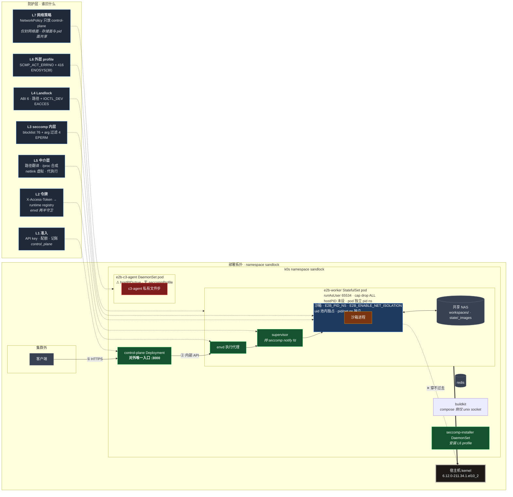

# 安全框架

写给下一个人接手这块时看的。不是审计报告 —— 报告在 `findings*.md`，这里只回答两个问题：
**防线摆在哪、哪条缝要往哪查**。

所有读数除注明外都是 2026-10-04 在 k0s 集群（2 节点 arm64、kernel `6.12.0-211.34.1.el10_2`、
containerd 2.3.4、Rocky 10.2、部署版本 `0.1.0-979`）实测的。

## 威胁模型

攻击者已经**在沙箱内拿到任意代码执行**：任意命令、PTY、文件 API、任意 env、任意 cwd、
网络按策略。读得着自己的整个 rootfs，可以无限次试。

按后果分四类，和 `attack-surface.md` 的编号一致：

| | 目标 | 典型后果 |
|---|---|---|
| L1 | 沙箱 → 宿主 / worker | 逃逸，读到节点上别的租户 |
| L2 | 沙箱 → 另一个沙箱 | 横向，读别人的 workspace |
| L3 | 沙箱 → 平台面 | 越权，拿到控制面或 c3-agent |
| L4 | 打垮 worker / 节点 | 可用性 |

不在模型内：控制面 API key 泄露、节点 root 失陷、DNS 劫持。这些是运维面的事。

## 架构图

左右两轴：**左边是防护层**（谁拦什么、各自的拒绝指纹），**右边是部署拓扑**（真实的 namespace / workload / pod）。虚线表示该层管住哪些单元。

看图的三件事：

1. **L6 外层 profile 之下就是宿主 kernel** —— 它是唯一通到宿主的层。L3/L4/L5 全穿也只到 worker 容器。
2. **c3-agent 那一格是红的**：hostPID=true 且无 seccompProfile，**面 B 是节点上唯一的 root**，
   而它整套隔离只有 L7 那一条 NetworkPolicy 挡着 —— 改一个策略就打通。
3. **CP 与 agent 之间是三条具名通道，不是单向隔离** —— `ingress` 只有一个 `from` 条目
   （`app: control-plane`），端口 `:49985` 面 A 授身份、`:49986` 面 B 做文件操作，
   外加 agent → CP `:3000` 的巡检上报。
   **这条策略只封网络面**：worker 与 agent 还共享四个同路径挂载点
   （`/var/lib/e2b/{workspaces,e2b-sandboxes,state,e2b-images}`，设计如此 —— `chown`
   必须落在 worker 看得见的树上），而 `hostPID` 让 agent 看得见 worker 全部进程。
   风险的方向因此是"沙箱从下面够上来"，不是"agent 从上面看下来"。

两张图答两个问题：第一张答"改哪一层会破什么"，第二张答"谁看得见谁"。

判定链是**四层**（即下文各层职责的 ①②③④，不含 L1/L2 准入令牌与 L7 网络策略）：
前 3 层是沙箱代码（fork + envd），第 4 层是部署配置。
**打穿前三层只能到 worker 容器，打穿第四层才到宿主** —— 第四层是唯一值得当
边界看的那层。

## 各层职责

### ① seccomp 内层（`third_party/sandlock`）

进程级、默认动作拒绝。两类规则：

- **blocklist**（`sys/structs.rs::DEFAULT_BLOCKLIST_SYSCALLS`）：按**名字**。
  当前含 mount / pivot_root / chroot / keyctl / add_key / request_key /
  perf_event_open / bpf / userfaultfd / cachestat / lsm_\* / mseal /
  四个 xattr-at / statmount 等。名字走 `syscalls` crate 解析，"加进表" 与
  "这个编号被拒" 是同一件事。
- **arg 过滤器**（`seccomp_plan.rs`）：按**参数**。四处
  - `clone`：`CLONE_NEW*` 位
  - `socket`：`SOCK_RAW`（无条件拒）/ `SOCK_DGRAM`（仅无网络规则时拒）on `AF_INET`/`AF_INET6`
  - `ioctl`：20 个请求码
  - `prctl`：`PR_SET_DUMPABLE`/`PR_SET_SECUREBITS`/`PR_SET_PTRACER`

  ioctl 那份是重点。`ioctl` 在 seccomp 里**没有请求码粒度**，JEQ 链是唯一有粒度的地方，
  所以它列了什么就是全部。20 条分三类：
  - 已拒：`TIOCSTI` / `TIOCLINUX`（终端注入）、`SIOCGIF*` + `SIOCSIF*` + `SIOCETHTOOL`
  - 新拒：`FS_IOC_FIEMAP` / `FIBMAP` / `FIGETBSZ`（普通文件布局预言机 —— Landlock 的
    `FS_IOCTL_DEV` 只管设备文件，普通文件上的 ioctl 完全无闸）
  - **故意不拒**：`TCSETS*` / `TIOCSWINSZ` / `TIOCSETD` 等终端写入族。理由见下面「冗余」

**arg 过滤器的失效是静默的**：请求码写错 ⇒ JEQ 永不匹配 ⇒ 表里看着有、实际不拒。
所以 `context/tests.rs` 把这三个常量值连同它们在过滤器中的存在一起钉住。

### ② Landlock（fork `landlock.rs` / `protection.rs`）

路径粒度 + 设备 ioctl 粒度。默认 `strict_all()`：够不着的保护直接让 `build()`
**拒绝建箱**，不静默降级；只有显式标 `Degradable` 的才会静默丢 mask 位。

当前六项及其 floor：`FsRefer` 2、`FsTruncate` 3、`NetTcp` 4、`FsIoctlDev` 5、
`SignalScope` 6、`AbstractUnixSocketScope` 6。**最高 6 = 生产 ABI**，所以线上无降级。
（本地车道 ABI 8，但这不是问题 —— 问题是"声明的 floor 够不够得着"，见
`protection.rs` 里那两个 `*_deployed_abi` 测试。）

`IOCTL_DEV` 从 ABI 5 起才有，6 满足 ⇒ 设备节点那层闸在线上是生效的。

### ③ 中介层（envd + fork supervisor）

seccomp 与 Landlock 抓不到的语义在这里：

- **路径翻译**：`chroot` 形态下子进程的**内核根是宿主 `/`**，fork 不调 `chroot(2)`，
  而是让子进程 chdir 进 rootfs 内的宿主路径，再把每个被拦的路径 syscall 翻成
  `<chroot_root>/<虚拟路径>`。推论：**任何不在 `chroot_path_syscalls()` 里的带路径
  syscall 都会以宿主根为基准执行** —— `chroot` 自己就是这样漏过一次。
- **procfs 合成**（`procfs.rs`）：`/proc/net/dev`、`if_inet6`、`tcp`/`tcp6`
  （按已绑定端口过滤）都是生成的不是真的；`/proc/kcore`、`/sys` 直接拒。
- **netlink 虚拟**：只有 `NETLINK_ROUTE` 放行，换成 `socketpair(AF_UNIX)` 由
  supervisor 应答合成报文；别的协议（`NETLINK_XFRM`/`NETLINK_KEY`）EAFNOSUPPORT。
  socket family 白名单只有四个：`AF_UNIX`/`AF_INET`/`AF_INET6`/`AF_NETLINK`。
- **代执行**：`connect`/`sendto` 由 supervisor 在 **worker netns** 里代建连。
  ⇒ **per-sandbox netns 只隔离入站与回环，出站目的地址完全由规则决定**，netns
  不构成出站防线。

### ④ 外层 profile（`deploy/seccomp/sandlock-worker.json`）

`SCMP_ACT_ERRNO` 兜底 + 416 条允许项。默认动作给 **ENOSYS(38)**，
这和内层 blocklist 的 **EPERM** 是两种指纹，调试时别混。

**已知只靠它挡的**：15 个 6.13 才引入的 syscall（`fchmodat2`、四个 xattr-at、
`file_getattr`/`file_setattr` 等）。生产 kernel 6.12 上它们全 ENOSYS，所以今天没有
可利用面；但这份清单描述的是"内核升到 ≥6.13 且外层换了"那个窗口。逐项见
`layer-attribution-2026-10-04.md`。

### ⑤ c3-agent

`hostPID: true`、**无 seccompProfile**。一个 DaemonSet、两个容器：**面 A**（uid 65534，
`:49985`，`grant-slot` 授身份）与**面 B**（**root**，`:49986`，`chown`/`rm`/`walk` +
`materialize`）—— 面 B 是 C1 的 broker 退役后**这个节点上唯一的 root 组件**。
`hostPID` 是 pod 级字段，所以面 A 也拿到它。

对沙箱方向的**网络**隔离手段是那条 NetworkPolicy：`ingress` 只有一个 `from`
（`app: control-plane`）与那两个端口 ⇒ **worker 来敲在连接层就被挡**，且
`E2B_C3_AGENT_TOKEN` 不在任何 worker manifest 或镜像里。这是当前架构里**最薄的一环**
—— 一个网络策略变更就能打通。

但**网络是唯一的被封的面**，另外两个面是开的：

- **存储面共享（设计如此）**：面 B 与 worker 挂同一批卷的同一路径 ——
  `/var/lib/e2b/workspaces`、`/var/lib/e2b-sandboxes`（RWX claim）、
  `/var/lib/e2b/state`、`/var/lib/e2b-images`。这是必需的：`chown` 必须落在 worker
  看得见的树上，`priv_common.c` 的白名单按**解析后的路径**比较，两侧指不到同一个
  目录就会 `EPERM`。边界因此是**五根路径白名单**（workspace / state / node-state /
  共享卷 / image-cache），不是任意路径。
- **pid 面开着**：`hostPID` 是 pod 级字段，两个容器都拿到；且**无 seccompProfile** ——
  技术上既看得见也能改 worker 的进程。挡住它的是 **op 表里没有动进程的操作**，
  即**接口约定，不是内核强制**。

`hostPID: true` 只属于 c3-agent，**worker 不是**。实测（2026-10-04）：

| | hostPID | pod 内可见 pid 数 |
|---|---|---|
| `e2b-worker` | 未设（false） | 4–5（只有自己 pod 的） |
| `e2b-c3-agent` | **true** | 节点全部 |
| `seccomp-installer` / `control-plane` | 未设 | — |

worker 容器另有一层 `E2B_PID_NS=true`，沙箱在自己的 pid ns 里
（实测沙箱内 `$$` = 3，说明它不是 pod 的 pid 1）。

**别拿沙箱内 `/proc` 的数字目录数当证据**：实测恒为 0，连自己 fork 出来的进程都
数不到，而 `/proc/1` 是 `Permission denied`。那是 fork 的 procfs 规则（合成 + 拒绝），
说明的是"看不到"，不是"不存在"。pid ns 的证据取自 pod 规格与 `$$`，不取自这里。

## 冗余原则：两道腿

同一个属性常常由两个独立机制保，改一个另一个还在。两个已知例子：

**① 隐藏宿主网卡名** —— netlink 合成 + `SIOCGIF*` ioctl deny list。
危险在于两者互不暗示：有人删掉 ioctl 那份（"netlink 已经虚拟化了，ioctl 那份多余"），
`SIOCGIFCONF` 会立刻重新泄露 `tunl0`/`eth0`。钉在
`tests/security/test_socket_families.py::test_netlink_route_discloses_no_host_interface`。

**② 终端写入族不加 deny 的两个前提** —— `/dev/pts` 是每沙箱 devpts 实例，
`/dev/tty` 打不开（ENXIO），加上沙箱内同 uid。加了 deny 会打断 `tmux`/`vim`/`ssh`/
`openpty` 和平台自己的 PTY endpoint（`envd_service/route_b.py:1266`、
`envd_service/executors/local.py:93,135`），
而它能攻击的面不可达。前提变了就该加回去 —— 钉在
`tests/security/test_ioctl_inventory.py`。**两个前提缺一，测试变红。**

## 已知结构缺口

按"能不能被沙箱够到"分，不是按严重度。

**够不到，但根子在外面**

| 项 | 状态 |
|---|---|
| CVE-2026-53362（`__ip6_append_data()` UDP corking 发送路径，CISA KEV 在列） | kernel `6.12.0-211` 未打（修复在 6.12.95）。**机制**：corked 报文跨分片边界时 `fraggap` 未计入 `alloclen`，越界 15 字节写进 `skb_shared_info`；跑在**调用进程上下文**、由 `sendmsg(2)`/`splice(2)` 驱动，**不是 softirq、不是重组路径**。**线上实测（2026-10-04，k0s，只读）**：`disable_ipv6=0`（IPv6 栈开着）；`if_inet6` 只有 link-local + `::1`，**无全局地址**；`ipv6_route` **无 `::/0`**；`udp6→fe80::1%eth0` = `ENETUNREACH`；`udp6→::1` 裸内核层**成功**；`socket(AF_INET6,SOCK_DGRAM)` 成功；MTU `lo`=65536/`eth0`=1450。**真正卡住这条链的是没有可路由的全局 IPv6 + `::1/128` 在生效的 deny 清单里**（该变量 k8s 未设，由 `config.py::_network_deny_cidrs()` 回落到内置 15 条 默认；仅显式置空才关闭）⇒ 默认配置的沙箱在 L7 就被挡。**条件 4（`NETIF_F_SG`）无法安全实测** —— 曾据 `/sys/class/net/*/flags` 断言 `lo`/`eth0` 都没有 SG 是**错的**，该文件是 IFF_* 而非 NETIF_F_*，且 `NETIF_F_*` 无 sysfs 可读；唯一确认办法是真正走 paged 分支（即触发 bug）。**缓解不止打补丁**：`MSG_SPLICE_PAGES` 是内核内部 flag、syscall 入口即被清掉（实测非页对齐 buffer 带该 flag 发送仍成功 ⇒ 用户态设不上），用户态唯一入口是 `splice(2)`；**拦 `splice` 到 socket 可切断触发链且不用改内核**，与目的地策略是独立两层。`user.max_user_namespaces=0` **不可用**（沙箱靠 userns）；`esp4`/`esp6` 屏蔽无效。**可利用性**：公开链要求 x86_64 LA57，CIQ 明确 aarch64 不受影响 ⇒ 当前 arm64 是「**可触发、不可利用**」，但**不是设计安全而是落在 arm64 的运气** —— 同架构跑 x86_64 即为实打实可逃逸，且公开 exploit 的两个前提（非特权 user namespace、容器内代码执行）正好都由本架构提供。内核提权一旦成功，容器侧加固一律无效。排期理由是「KEV + 触发入口在沙箱可拦却没拦」，**不是**已证实可提权。**命名待修**：`third_party/sandlock/netlink/handlers.rs:47` 把它与 "Dirty Frag" 并列，CIQ/RH 均明确二者独立（submodule，未改） |
| 6.13 `*at` 族 | 15 个只靠外层 profile。见上 |

**够得到，已挡，但机制是巧合而非策略**

| 项 | 现状 |
|---|---|
| `AF_RXRPC`（CVE-2026-43500 的面） | 白名单挡住，但节点上模块恰好不可用。现在两层都在：白名单 + `REFUSED_FAMILIES` 具名 |
| `AF_KEY` | 同上，`REFUSED_FAMILIES` 已具名 |

**架构级的已知项**（在 `findings*.md` / `open-issues.md`，此处不重复）

- 平台面无租户隔离（OBS-6）：一个 API key 能管所有沙箱
- `max_disk` 的"共享 workspace 形态不生效"记录**已更正**（OBS-5，2026-10-05）：那是
  "没有中介的 pure 形态"，已被 N15 中介化 + N14 S5 T1 具名拒绝，集群实测六条写路径全部 EFBIG
- `c3-agent` 无 syscall 过滤，靠网络策略单点

## 门禁在哪

改了哪层，就该跑哪组。

| 改什么 | 跑什么 |
|---|---|
| fork 的 syscall 面 | `cargo test -p sandlock-core --lib`（918+ 绿，2 个环境项） |
| fork 的 socket/netlink 面 | 同上 + `tests/security/test_socket_families.py`（需沙箱车队） |
| Landlock 保护或 floor | 同上 + `protection.rs` 的 `*_deployed_abi` 测试 |
| envd 鉴权 | `tests/security/test_envd_token_fail_closed.py` |
| c3 特权面 | `tests/unit/test_priv_maint_worker_gate.py` |
| 宿主接口名 | `tests/security/test_ioctl_inventory.py` |

`tests/security/` 里需要真实沙箱车队，**没跑就是没跑**，不要拿别的套件绿了充数。

## 改这份文档的规矩

1. 结论要么有实测读数，要么有代码位置。两者都没有就是猜测，标出来。
2. 「没找到证据」和「确认安全」是两回事，本文分开写。
3. 归因要跨层对照。同一探测在沙箱内和沙箱外各跑一遍，否则分不清是谁拒的 ——
   单跑沙箱会把"模块恰好没加载"读成"沙箱挡住了"。
