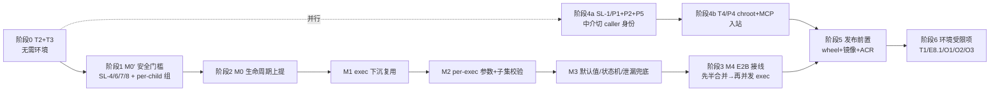

# Sandlock 未实现目标 —— 剩余工作实施计划（2026-09-04）

> **执行状态（2026-09-27 更新）**：清零目标**已达成**（M0′–M4、SL-1/T4 全部落地并上线），本文件留档。
> **仍有效的决定**：一个沙箱 = 一个实例；`SL-1` 的"建箱前拒绝、无降级档"纪律至今有效。
> **已作废的假设**：把运行时基线钉在 `upstream-pr/netns-free-clean`（**无** netns）——2026-09-16/17 起 per-sandbox netns 与 pid_ns 已全量（`docs/production-deployment-requirements.md` §2.4.10）。证据：`docs/open-issues.md` §四。

> **For agentic workers:** REQUIRED SUB-SKILL: Use superpowers:subagent-driven-development (recommended) or superpowers:executing-plans to implement this plan task-by-task. Steps use checkbox (`- [ ]`) syntax for tracking. 本文是"还剩什么 + 按什么顺序做"的执行计划；每个阶段（尤其阶段 1/2 的 Rust 改造）在执行前仍需按本仓库惯例拆出组粒度的详细 plan（见 `docs/superpowers/plans/2026-09-01-sandlock-e2b-completion-roadmap.md` 的分层方式）。

**Goal:** 清零 sandlock 项目当前**所有未实现目标**：先用两个"不需要环境"的缺陷修复（T2/T3）换取干净基线，再按 fork 侧安全门槛 M0′ → 实例化 M0–M3 → E2B 接线 M4 → 路径中介身份 SL-1/T4 的顺序推进，最后收口发布前置与环境受限项。

**Architecture:** 两条代码线通过"wheel 构建 → 子模块提交 → E2B 消费"衔接。`third_party/sandlock`（Rust fork，基线 `upstream-pr/netns-free-clean`）承担隔离与实例化改造；本仓库 `envd_service/executors/sandlock.py` + `process/manager.py` + `control_plane/` 承担沙箱=实例的生命周期接线。核心决策已定：**一个 E2B 沙箱 = 一个长命 sandlock 实例**（fork 文档 §8，取代共享资源组 P10），目的是让"执行边界 = 产品边界"，从根上消除 §3.8 的内存/CPU/进程配额超卖（实测默认 K=2 ⇒ 1.76x）。

**Tech Stack:** Rust（sandlock-core / sandlock-ffi / sandlock-oci / PyO3）、CPython 3.14、FastAPI + Redis、XFS project quota、pytest（unit/contract/security/perf/sdk）、zig 交叉编译 wheel、Docker/buildkit + ACR。

## Global Constraints

- "不推送远程" = 不做目标机远程部署（`upgrade.sh` / 远程复测暂缓）；ACR 镜像推送照常；git 远程推送（origin / 上游 PR）暂缓，本地提交照常。
- sandlock 运行时基线固定 `upstream-pr/netns-free-clean`；全部 sandlock 改动必须在 **uid 65534 非 root** 形态下验证。
- fork 三套全绿基线（Linux 容器非 root）：lib `788` / integration `465` / python `430`。
- E2B 全量基线（镜像 rootfs + netns + XFS + npm + strict 全开）：`867 passed / 1 skipped / 2 xfailed / 0 failed / 0 error`。2 条 xfail = T4/T5，**修好即 XPASS 变红，必须摘标记**。
- 放行门槛：**M0′ 未清零前，`exec` 不得接进 envd**（fork 文档 `sandbox-exec-security.md` §7「不要做的事」）。也不得用"配额除以 K"绕过超卖。
- 测试规范：断言精确匹配（禁 `toContain`/`includes` 类部分匹配）、禁 skip 掩盖、日志驱动排查、性能测试必录 profile 到 `tmp/perf/`。
- 临时文件一律放项目内 `tmp/`。
- 每个任务完成后：相关测试全绿 + 本地提交（fork 改动=子模块提交 + 主仓库指针 + 记录到 `third_party/sandlock/docs/e2b-integration.md`）。

---

## 1. 未实现目标盘点（读取结果）

来源：`docs/task-backlog.md`、`docs/HANDOFF.md`「未完成 / 待办」、`third_party/sandlock/docs/e2b-integration.md` §2/§3.8/§3.9/§8、`third_party/sandlock/docs/sandbox-exec-security.md` §4–§7。

| 编号 | 目标 | 归属 | 阻塞 | 规模 |
|---|---|---|---|---|
| **T2 / P3** | `_HANDLED_FIELDS` 漏登记 `notify_rate_limit` ⇒ 每次建沙箱一条假告警 | fork | 无（一行） | XS |
| **T3** | `SnapshotRegistry` 快照自嵌套 `snap_X/fs/snap_X/fs/…` → `ENAMETOOLONG`，无用例覆盖 | E2B | 无 | S |
| **SL-4** | `extra_fds` 用 `dup2` 落位清掉 `FD_CLOEXEC` ⇒ 宿主↔init 控制 socket（fd 3）被**每个**用户进程继承；实测可伪造 `Exited` 让宿主 `exec` 返回 0 而进程仍在跑 | fork | 无 | M |
| **SL-8** | `proc_count` 唯一归还点是阻塞 `wait4` ⇒ 孤儿永久占配额（实测可累加 `1/7→2/8→2/5`） | fork | 无 | M |
| **SL-6** | `sandlock-init` 无 `waitpid(-1)` 兜底 ⇒ 收养孤儿变 `<defunct>` | fork | 无 | S |
| **SL-7** | 控制协议无鉴权（`SO_PEERCRED` 只告警不拒绝、verb 无租户绑定）⇒ 实测可对**别人的** `control.sock` 发 `config` 拿到对方策略 | fork | 无 | M |
| **SL-5** | init 解析失败/EOF/`RunMain` 分支不关 fd、帧边界按字节流猜 | fork | 无 | S |
| SECE-6 | 沙箱内 `killpg(getpgid(0))` 一条命令打死整箱（child 共享 pgid） | fork | 随 M0′（per-child 组） | M |
| §10 H1/H2 | `early_exits` 无上限 + 未知 pid 照收（60k 帧 +5.3 MB RSS）；`InitLink::request()` 无 deadline | fork | 随 M0′ | S |
| **E10 / M0** | `ResourceState`/listener/控制目录/DNS 网关生命周期从 create 提到 instance（行为不变） | fork | M0′ | M |
| **E10 / M1** | init 循环 + `proto`/`fdpass` 从 `sandlock-oci` 下沉 core；`instance.exec()/wait_child()/kill_child()` + child id + stdio 交付 | fork | M0 | L |
| **E10 / M2** | per-exec `cwd/env/extra_writable/bind_ports` + 策略**子集校验**（越界显式拒绝）+ 网络策略绑 pid | fork | M1 | L |
| **E10 / M3** | S1 `max_processes` 默认联动（回归风险最大项 Q10）、S3 checkpoint 拒绝、S4 `pid_ns` reaper、S5 `Dead` 语义、S7 泄漏兜底 | fork | M2 | M |
| **E10 / M4** | E2B 接线：**先只做"网关+命令"半合并**，再把 §3.8 超卖探针改成断言，最后开放并发命令 exec | E2B | M3 | L |
| **SL-1 / P1+P2** | 路径中介以 **supervisor 身份**代执行 `openat/unlinkat/fchmodat/…` ⇒ 沙箱文件属主变 root、`chmod` EPERM、1777+sticky per-uid 保护失效；修法 = `setfsuid/setfsgid(caller)` 包住被中介 syscall 或 `openat`+`fchown`，并加 `mediation_run_as = caller\|supervisor` 开关 | fork | 无（独立于 exec） | L |
| **P5** | `fs_mount` 只接受目录根 ⇒ 调用方只能整树挂 `/dev`，正好放大 SL-1 | fork | 建议与 SL-1 同批 | M |
| **T4 / P4** | `net_isolation` + 镜像 rootfs(chroot) 形态下 MCP 入站端口映射起不来（纯 sandlock 形态 3/3 通过） | fork | 无 | M |
| 发布前置 | `wheels/fork` 需按最终 tip 重建（当前 wheel 时间早于 E7 两个 sandlock 提交）→ 重建 worker/测试镜像 → 推 ACR | 两端 | 需 fork 改动落地 | S |
| **T1** | 真实 XFS/ext4 目标机复测沙箱文件属主（overlayfs 上 EPERM，现带证据跳过） | E2B | **需目标机** | S |
| **E8.1 / E1.2** | 目标机部署与远程 smoke | E2B | **用户约束** | M |
| **O1/O2/O3** | 目标机 XFS prjquota、TLS 代理层、凭据管理 | 运维 | **维护窗口** | — |
| P6/P7/P8 | `getsockname`/`EINPROGRESS` 语义、cp310–313 wheel 矩阵、上游 PR 推送（token 只读且无 `gh`） | fork | 权限 / 本期外 | — |

> SL-1 与 exec 主线**互不依赖**，但它决定 T5 那条 xfail 能否摘除，也决定 §8 S6（长命实例下代打开的属主错位从"每命令"放大到"整箱生命周期"）—— 因此排在 M4 之前、可与阶段 1 并行。

---

## 2. 执行顺序



M4 之前**任何**阶段都不向 envd 暴露 `exec`；fork 侧改动全程用"不开放给 E2B"的开关/内部 API 推进（M1 验收口径即"不开放 e2b 使用"）。

---

## 阶段 0：不需要环境就能做的两个缺陷

### Task 0.1（T2 / fork P3）：登记 `notify_rate_limit`，消掉每条日志的假告警

**Files:**
- Modify: `third_party/sandlock/python/src/sandlock/_sdk.py:1138`（`_NativePolicy._HANDLED_FIELDS`）
- Test: `third_party/sandlock/python/tests/test_sandbox.py`（`class TestUnwiredFieldWarning`，约 :863）

**Interfaces:**
- Consumes: 现有 `_build_from_policy` 对 `notify_rate_limit` 的实际调用（`_sdk.py:1217-1218` → `sandlock_sandbox_builder_notify_rate_limit`）。
- Produces: `Sandbox(policy=Policy(notify_rate_limit=N))` 建箱时**不再**产生 `"not wired through FFI"` 告警。

- [ ] **Step 1：写失败测试**（追加到 `TestUnwiredFieldWarning`，断言精确、不用 `in` 模糊匹配整条消息以外的部分）

```python
    def test_notify_rate_limit_is_declared_handled(self):
        """`notify_rate_limit` 真的经 FFI 生效，不得被当成未接线字段。"""
        import warnings
        assert "notify_rate_limit" in _NativePolicy._HANDLED_FIELDS
        with warnings.catch_warnings(record=True) as w:
            warnings.simplefilter("always")
            _policy(notify_rate_limit=1000).run(["echo", "ok"])
        assert [str(x.message) for x in w
                if "notify_rate_limit" in str(x.message)] == []
```

- [ ] **Step 2：跑测试确认失败** — Run: `python -m pytest python/tests/test_sandbox.py::TestUnwiredFieldWarning -q`（Linux 容器内）；Expected: `assert "notify_rate_limit" in _HANDLED_FIELDS` 处 FAILED。
- [ ] **Step 3：一行实现** — 在 `_HANDLED_FIELDS` 的 `"uid", "gid",` 行后加 `"notify_rate_limit",`。
- [ ] **Step 4：跑测试确认通过** — 同一命令，Expected: 该 class 全 PASS；随后 python 套全量回归（基线 430）。
- [ ] **Step 5：文档与提交** — `e2b-integration.md` §2 把 P3 标为 ✅，§3.2 标注已修；fork 提交 `fix(python): register notify_rate_limit in _HANDLED_FIELDS (P3)`；主仓库 `git add third_party/sandlock` 提指针。

### Task 0.2（T3）：快照自嵌套 —— 先复现，再加守卫

**Files:**
- Modify: `control_plane/registry/snapshots.py`（`create_from_sandbox` :93、`expand_to` 文件末）
- Test: `tests/unit/test_snapshot_registry.py`（新建）
- Read-only 取证：`tmp/stale-20260902/`（4.9 G，含事故现场；确认无用后单独一次提交删除）

**Interfaces:**
- Consumes: `SnapshotRegistry(base_dir)`、`record.fs_path`、`snapshot.json` 作为快照根的标记文件。
- Produces: `create_from_sandbox(...)` / `expand_to(...)` 在源与目标互为包含、或工作区内混入快照存储时，**要么显式 `ValueError`，要么按 ignore 规则剪掉存储**；不再出现 `snap_X/fs/snap_X/fs/…`。

- [ ] **Step 1：从证据定位触发形态**（一次性，只读）—— `find tmp/stale-20260902 -maxdepth 6 -name snapshot.json | head`，确认嵌套链条的根：期望看到"工作区目录同时是 `workspace_base`，而 `SnapshotRegistry` base 在其下（`control_plane/app.py:227` 默认 base = `workspace_base`，即快照目录与沙箱工作区同级）"。结论写进提交信息。
- [ ] **Step 2：写失败测试**（三条，覆盖两个方向 + 一条正例）

```python
"""T3: 快照存储被复制进快照自身会指数嵌套，最终 ENAMETOOLONG。"""
from __future__ import annotations

from pathlib import Path

import pytest

from control_plane.registry.snapshots import SnapshotRegistry


def _registry(base: Path) -> SnapshotRegistry:
    return SnapshotRegistry(base)


def _snapshot_from(reg: SnapshotRegistry, workspace: Path, sid: str):
    return reg.create_from_sandbox(
        workspace_dir=workspace,
        template_id="base",
        env_vars={},
        metadata={},
        volume_mounts=[],
        base_image=None,
        allow_internet_access=False,
        snapshot_id=sid,
    )


def test_expand_to_rejects_destination_inside_source(tmp_path):
    reg = _registry(tmp_path / "store")
    src = tmp_path / "sbx_1"
    (src / "workspace").mkdir(parents=True)
    (src / "workspace" / "a.txt").write_text("x", encoding="utf-8")
    rec = _snapshot_from(reg, src, "snap_a")

    with pytest.raises(ValueError, match="destination .* inside its source"):
        reg.expand_to(rec, Path(rec.fs_path) / "nested")


def test_snapshot_of_workspace_containing_store_prunes_store(tmp_path):
    """工作区里混进快照存储时，复制必须剪掉存储，不得自我嵌套。"""
    store = tmp_path / "snapshots"
    reg = _registry(store)
    victim = _snapshot_from(reg, _seed(tmp_path / "sbx_victim"), "snap_victim")

    # 事故形态：某沙箱工作区把存储目录整个带了进来
    ws = tmp_path / "sbx_2"
    (ws / "workspace").mkdir(parents=True)
    (ws / "workspace" / "keep.txt").write_text("keep", encoding="utf-8")
    import shutil

    shutil.copytree(store / "snap_victim", ws / "snapshots" / "snap_victim", symlinks=True)
    (ws / "data").mkdir()  # 普通目录必须原样保留：守卫不得过度剪枝
    (ws / "data" / "keep.bin").write_bytes(b"1")

    out = _snapshot_from(reg, ws, "snap_2")
    assert (out.fs_path / "workspace" / "keep.txt").read_text(encoding="utf-8") == "keep"
    assert (out.fs_path / "data" / "keep.bin").read_bytes() == b"1"
    assert not (out.fs_path / "snapshots").exists()
    assert list(out.fs_path.rglob("snapshot.json")) == []


def _seed(path: Path) -> Path:
    (path / "workspace").mkdir(parents=True)
    (path / "workspace" / "f.txt").write_text("seed", encoding="utf-8")
    return path
```

- [ ] **Step 3：跑测试确认失败** — Run: `tmp/testenv/bin/python -m pytest tests/unit/test_snapshot_registry.py -q -p no:cacheprovider`；Expected: 第 1 条 FAILED（未抛 `ValueError`，而是复制成功或 `OSError: ENAMETOOLONG`），第 2 条 FAILED（`assert not (out.fs_path / "snapshots").exists()` 为假 —— 剪枝守卫尚未存在）。
- [ ] **Step 4：实现守卫**

```python
def _is_within(child: Path, parent: Path) -> bool:
    """child 是否等于或在 parent 之内（两者都已 resolve）。"""
    try:
        child.relative_to(parent)
        return True
    except ValueError:
        return False


def _is_snapshot_root(path: Path) -> bool:
    """这个目录本身是不是快照根（`_write_record` 固定产出 snapshot.json）。"""
    return (path / "snapshot.json").is_file()


def _holds_snapshots(path: Path) -> bool:
    """path 是快照根，或直接装着快照根（= 存储目录被带进了工作区）。"""
    if _is_snapshot_root(path):
        return True
    try:
        return any(child.is_dir() and _is_snapshot_root(child)
                   for child in path.iterdir())
    except OSError:  # 权限/竞态：宁可当普通目录复制，也不吞掉整棵树
        return False
```

`create_from_sandbox` 在 `copytree` 前拒绝"目标落在源之内"，并用 ignore 回调剪掉存储目录（剪最外层即可，`copytree` 不再深入）：

```python
        src = Path(workspace_dir).resolve()
        dst = Path(fs_path).resolve()
        if _is_within(dst, src):
            raise ValueError(
                f"snapshot destination {dst} is inside its source {src}"
            )

        def _prune_store(directory: str, names: list[str]) -> set[str]:
            here = Path(directory)
            return {
                n
                for n in names
                if _holds_snapshots(here / n)
            }

        shutil.copytree(
            src, dst, symlinks=True, dirs_exist_ok=False, ignore=_prune_store
        )
```

`expand_to` 复用同一个 `_prune_store`，并在复制前做同样的 `_is_within(target, record.fs_path)` 拒绝。

- [ ] **Step 5：跑测试确认通过** — 同一命令，Expected: 3 passed。
- [ ] **Step 6：契约回归** — `... -m pytest tests/unit tests/contract/test_snapshots.py -q -p no:cacheprovider`，Expected: 全绿且用例数与基线一致（无新增 skip）。
- [ ] **Step 7：文档与提交** — `docs/HANDOFF.md` 把 T3 从待办移到已完成并写明守卫规则；主仓库提交 `fix(snapshots): refuse self-nesting copies and prune embedded store roots (T3)`。
- [ ] **Step 8（可选，单独确认）** — 清理取证目录：`tmp/stale-20260902/`（5 GB，HANDOFF 已标"确认无用即可删"）。删前 `du -sh` + 向用户确认。

### Task 0.3：复核 HANDOFF 里唯一未闭环的"环境类"记录（避免下次误判成新缺陷）

**Files:** Read-only: `docs/HANDOFF.md:519-527`（09-02 那条 `token exchange failed: 401`）、`envd_service/runtime/oci_registry.py:324`、`control_plane/config.py:234-248`、`envd_service/config.py:203-217`

- [ ] **Step 1** 在容器内带 ACR 凭据跑 OCI rootfs 形态的镜像解析用例（`-e E2B_BASE_IMAGE=python:3.11-slim` + `E2B_IMAGE_REGISTRY*`），确认 09-03 的"凭据按 `image_registry_host` 精确作用域"（E8.4）是否已消掉那次 `401 incorrect username or password`。
- [ ] **Step 2** 若已消：把 `docs/HANDOFF.md:519-527` 该条改为"已由 E8.4 关闭（证据：本轮日志）"；若仍在：定位为 fixture 环境变量泄漏，写一条 `tests/unit/` 用例断言"凭据 host 不匹配时不下发 `Authorization`"，再修。
- [ ] **Step 3** 一次文档提交（无论结论是哪个），保证「待办」小节只剩真的待办。


---

> fork 侧全部改动（M0′、M0–M3、SL-1/P1/P2/P5、P4、P3、P6）已在 **fork 仓库内单独成计划并自带完整验证入口**：[`third_party/sandlock/docs/fork-plan-2026-09.md`](../../third_party/sandlock/docs/fork-plan-2026-09.md)。本文阶段 1–2 与阶段 4 的 fork 任务以那份文档为准（任务编号 `F0–F9`），本文只保留 E2B 侧接线与顺序依赖，避免两处描述漂移。

## 阶段 1：M0′ —— fork 侧安全前置（gate，exec 接进 envd 之前必须清零）

> 共同验收：`sandbox-exec-security.md` §5.7 表中「fd 3 探测 / 伪造退出码 / 未知 pid 内存 / 杀一条 / 孤儿」五类用例先红后绿。前三条**现在就能在本机 OCI 路径上跑红**，不必等 core（文档 §10）。fork 三套全绿基线不得回退。

| Task | 缺陷 | 落点（现状） | 改造 | 验收用例 |
|---|---|---|---|---|
| 1.1 | **SL-4** 控制 socket 被每个用户进程继承 | `crates/sandlock-core/src/sandbox.rs:2317-2320`（`for &(target, source) in &extra_fds { dup2 }`） | 非 stdio 的 `extra_fds` 落位改用 `dup3(source, target, DUP_CLOEXEC)`（`target>=3` 时），0/1/2 仍保持可继承；init 侧 fork/exec 用户进程前对控制 fd 再显式确保 `FD_CLOEXEC` | §5.7「fd 3 探测」：沙箱内 `readlink /proc/self/fd/3` 必须失败 |
| 1.2 | §10 H1/H2 假 `Exited` 影响宿主、`early_exits` 无上限 | `crates/sandlock-oci/src/supervisor.rs:44/99/142`（`early_exits: HashMap`） | 宿主侧 reader 校验帧**来源与登记性**：只接受已登记 child pid 的退出帧；`early_exits` 设上限（超出即丢弃并计数）；伪造帧不得改变 `exec` 的等待结果 | 「伪造退出码」「未知 pid 内存不得涨 RSS」 |
| 1.3 | **SL-7** 控制协议无鉴权 | `crates/sandlock-core/src/control.rs:236-262`（`cred.uid != my_uid` 仅 `eprintln`）、`:136-147`（`kill(pid,0)` 判活即抢占目录） | 不匹配即**断开**；控制目录名哈希 + 身份 token 文件（比对 `/proc/<pid>/stat` starttime），冲突**拒绝**而非 `remove_dir_all`；verb 分级（`config`/`ports`/未来的 `exec` 需 token） | 「枚举并连接他人 control.sock ⇒ 一律 EACCES/ECONNREFUSED」「双 worker 同名沙箱第二个被拒」 |
| 1.4 | **SL-8** `proc_count` 无退出兜底 | `crates/sandlock-core/src/resource.rs:126-131`（自增）、`:545-560`（唯一归还点 `handle_wait`） | 以 **pidfd 为权威**：登记 fork 时拿 pidfd，退出信号/poll 驱动归还；周期对账 `proc_count` vs 活进程数，偏差即告警（对应 §5.6 `proc_count_vs_live`） | 「double-fork + `setsid` 孤儿回收后 `proc_count` 归零、之后仍能 fork」 |
| 1.5 | **SL-6** init 不是 reaper | `crates/sandlock-oci/src/init/mod.rs:118-207`（按特定 pid `wait_exit`） | `run_init` 主循环加 `waitpid(-1, WNOHANG)` 兜底回收，回收结果按 child 表路由；与 1.4 的 pidfd 记账共用一张表 | 同 1.4 + `<defunct>` 不得堆积 |
| 1.6 | **SL-5** fd 不关 + 帧边界按字节流猜 | 同上（解析失败/EOF/`RunMain` 分支）、`init/proto.rs` | 每个分支显式关闭收到的 fd（`M0′` 里优先级最低，但计入 `init_recv_fd_leaks` 指标）；帧协议改显式分帧 | 「畸形 exec 帧 ×1000 + 附 fd ⇒ init fd 数不增长」 |
| 1.7 | SECE-6 一条命令可打死整箱 | 现状 child 共享 `pgid`=init（实测三条命令全灭） | 每 child 一个进程组（`setpgid`），实例级 kill 遍历组集合；`pidfd_send_signal` 支持定向子树 | 「沙箱内 `killpg(自身 pgid)` 不得波及其它 child 与网关」 |
| 1.8 | `InitLink::request()` 无 deadline | `crates/sandlock-oci/src/supervisor.rs:75-95` | 每请求超时（默认 5 s，可配），超时 ⇒ 通道置 `Dead`（与 M3 的 S5 对齐） | 注入 init 挂死 ⇒ 宿主在 deadline 内拿到明确错误 |

- [ ] 1.x 每条一个 fork 提交：`fix(oci|core): <SL-n> <what>` + 对应回归用例；全部完成后重跑 wheel（`deploy/scripts/build-sandlock-wheels.sh`）并用 §5.7 探针在**当前 OCI 路径**上复测一遍。
- [ ] 阶段收口：`e2b-integration.md` §3.9 表里 SL-4/5/6/7/8 状态改「已修（commit）」，`docs/sandlock-upstream-issues.md` 索引同步；主仓库 `docs/task-backlog.md` E10 行的"安全前置"标注为已清零。

## 阶段 2：E10 fork 侧实例化（M0 → M3）

- **Task 2.1（M0）生命周期上提**：`ResourceState`、notif/throttle/loadavg/control listener、控制目录、DNS 网关从 create 路径提到 `SandboxInstance`；旧 `Sandbox.run/popen/spawn` 语义 = "一次性实例"，ABI 不破（`sandbox.rs:1061-1072` 的收尾搬到 `shutdown()`、`sandbox.rs:1375/1389/1404` 单槽 pid 待第 3 步）。**验收**：fork 三套全绿 + E2B 全量与基线逐名一致（`867 passed / 1 skipped / 2 xfailed`）。
- **Task 2.2（M1）exec 下沉复用**：把 `sandlock-oci` 的受限 PID-1 init 循环 + `proto`/`fdpass` 下沉 core；新增 `instance.exec()/wait_child()/kill_child()/resize_child()`、child id、stdio 经 SCM_RIGHTS 交付；FFI 增量 `sandlock_instance_exec` / `..._wait_child` / `..._kill_child`；Python `SandboxInstance.exec(...)` 返回自持句柄的 `Process`（解除 `Process<'a>(&'a mut Sandbox)` 借用，`sandbox.rs:3022`）。**不开放给 E2B。验收**：并发 exec、fd 归属、双 wait 幂等、stdin 关闭不死锁。
- **Task 2.3（M2）per-exec 参数 + 子集校验**：`cwd/env/extra_writable/bind_ports` 逐命令可变；越出实例上限**显式拒绝**（S9）；`update_network` 采"新 exec 生效、在跑 child 保持原策略"并回报 staleness（S2）；网络/凭据状态绑 pid（§4.5）。
- **Task 2.4（M3）语义与兜底**：`max_processes` 默认 64 ⇒ 按沙箱上调（S1/Q10，写 release note）；多 child 时 `checkpoint` **显式拒绝**（S3）；开 `pid_ns` 时 on-behalf 白名单按 `PidKey` 收窄到本 child 子树（S8/§4.4/§4.15）；`instance Dead ⇒ 统一错误码`、E2B 重建、不静默重启（S5）；idle/最大寿命回收 + 幂等 `shutdown()` 顺序（S7，§5.3 七步）。

## 阶段 3：E10 M4 —— E2B 侧接线

- **Task 3.1 半合并（第一步，收益/成本比最高）**：只把**网关 + 命令**并进一个实例，`max_concurrent_commands_per_sandbox` 保持 1（`envd_service/config.py:128`、`envd_service/process/manager.py:124 _CommandGate`）⇒ K 从 2 起降，§4.6/§4.8 耦合面最小。
- **Task 3.2 超卖探针改成断言**：`tmp/mem_overcommit_probe.py` 的口径落进 `tests/contract/`——同一沙箱第二条命令申请内存应被**拒**（不再是"记录偏差"）；`docs/SCALING.md`、`docs/resource-contention.md` 关闭"按沙箱预留 = 按实例核算"的说明（§3.8 随之关闭）。
- **Task 3.3 实例生命周期全覆盖**（§5.4 表）：`delete`/kill/TTL/驱逐/扩缩 ⇒ `instance.shutdown()`；`pause/resume` ⇒ 实例级 `freeze/thaw`；worker 重启**明确不恢复**（PDEATHSIG 已保证，写成有意行为）；命令超时只杀该 child 子树；`SandlockExecutor._build_sandbox`（`envd_service/executors/sandlock.py:512`）的 per-command 字段改走 `exec` 参数。
- **Task 3.4 可观测性**（§5.6）：`instance_children_live`、`proc_count_vs_live`、`notif_loop_lag_ms`、`init_control_fds_inherited`（应为 0）、`instance_state`、沙箱 id ↔ instance id ↔ child id 贯穿日志。
- **Task 3.5 才开放并发命令 exec**：同步调 `_CommandGate` 与容量文档，并把 §5.7 全表（14 条）落进 `tests/contract/`；24 h / 10k 命令轮转的 fd 与记账增长测试进 `tests/perf`（必录 profile 到 `tmp/perf/`）。
- **控制目录身份**：目录名用 sandbox_id + 身份 token（依赖 Task 1.3 的 token 机制，落位不得放 `/dev/shm`、名字要哈希 —— §7.65 抄 oci 的两点）。

## 阶段 4：SL-1 与 T4（可并行于阶段 1–2）

- **Task 4.1（P1+P2）** 路径中介的调用方身份：**不再在中介里补身份**，改走 fork 的 B 档（`F2b` `sandlock-supervise` 进程化）—— 服务中介的进程 euid 就是该沙箱 host uid，DAC 判定天然正确；fork 侧保留 `mediation_run_as` 与 A 档断言，并把 root 进程内跨 uid 中介（C 档）默认拒绝。
  > **2026-09-04 用户确认：走 B 档（fork F2b）** —— 每沙箱一个 `sandlock-supervise` 进程，其 euid == 该沙箱 host uid，特权只存在于 create 那一下。SL-1 与 SL-7 由构造消除，fork 侧 C 档（root 进程内跨 uid 中介）改为**默认拒绝**。**E2B 侧的新增前提**：生产 worker 是 `USER 65534`，自己无法变成 uid X 或 chown workspace ⇒ 需要一个新的最小特权入口（root launcher 持 CAP_SETUID/SETGID/CHOWN，或 setuid helper，或 systemd `User=` 每沙箱单元）；拿不到就按 A 档运行并放弃 per-uid 断言。M4 的接线形态随之改变：worker 不再持有 `Sandbox` 对象，而是持有控制通道（常驻池 = path+token；按需 = 交接的控制 fd，见 fork F2b.2），半合并（Task 3.1）与该通道模型是同一件事。 **D2（已确认）= 轮转槽位池**：slot 的 uid 只能在启动时定死（中介身份恒等于持有实例进程的 euid）⇒ 复用窗口 = 并发 slot 数 N，不是段大小 M；默认走 W1（N 个固定 uid slot 轮转分配），要把窗口做大到段大小 M 才需要 W2（slot 服务完退出、由部署层以新 uid 重启 ⇒ 需要 k8s SA 建 Pod 或一个能降权的 runner，静态 compose 的 `user:` 做不到运行期变更）。禁止的第三条：单 slot 运行时多 entry 映射新 host uid —— 中介会退回 W 身份，SL-1 复活。详见 fork 计划 F2b.3。✅ **B 档已确认（用户拍板 2026-09-04）**：交接形态 = 双传输（常驻池 path+token / 按需 launcher fd 交接）+ supervise 单代次（fork F2b.2/F2b.3）；A 档仅作拿不到第二 uid 环境的部署兜底。
  > 依据：`notif::supervisor(...)` 是持有实例进程内的 tokio 任务（fork `sandbox.rs:2915`）⇒ 中介身份恒等于该进程 euid；非 root 进程可自映射单 entry userns（fork `context.rs:290-292`），所以“supervisor 以 uid X 运行”就能让沙箱在宿主上是 X、在 ns 内是 0，绕开 §3.5 的“任意 host uid 需 root”（那条只限制映射别人的 uid）。
  **验收**：`tests/contract/test_uid_permissions.py:99` 与 `tests/contract/test_mcp_netns.py:147` 的 strict xfail **XPASS 变红 ⇒ 摘标记**；`written_by == ra.host_uid` 断言在 chroot 形态同样通过。
- **Task 4.2（P5）** `fs_mount` 支持单文件/设备节点，或提供"最小可用 /dev（ptmx/pts/null/urandom）"helper ⇒ 消除"整树挂 `/dev` + 必发 `fs_denied`"这个 SL-1 触发面。
- **Task 4.3（P4 / T4）** 修 `net_isolation` + chroot 下 MCP 入站端口映射起不来。
- **Task 4.4（T1，与 O1 同窗）** 真机复测沙箱文件属主与 1777+sticky 跨 uid 保护，去掉那两条"带证据跳过"。

## 阶段 5：发布前置（顺序固定）

1. fork tip 稳定后重跑 `deploy/scripts/build-sandlock-wheels.sh`（cp314 × x86_64/aarch64）→ `wheels/fork`；
2. `deploy/scripts/build-images.sh` 重建 worker/测试镜像（Dockerfile 按 ABI+ARCH 从 `wheels/fork` 安装）；
3. 容器内全量两形态复跑（默认 + `E2B_BASE_IMAGE=python:3.11-slim`，并跑 `E2B_TEST_NET_ISOLATION=1 E2B_TEST_STRICT_SKIPS=1`），0 failed / 0 error；
4. `deploy/scripts/build-and-push.sh` 推 ACR（照常允许）；
5. 更新 `docs/HANDOFF.md` / `docs/task-backlog.md` 基线数字与状态。

## 阶段 6：需要授权或环境的项（不阻塞前 5 个阶段）

| 项 | 需要 | 现状口径 |
|---|---|---|
| E8.1 远程 smoke、E1.2 目标机部署 | 用户解除"不做远程部署"约束 | 已改本地 compose 冒烟顶替 |
| O1 目标机 XFS `prjquota` | 维护窗口（可回退 `remount,noquota`） | 本地 losetup+XFS 已实测 |
| O2 TLS 证书/代理层、O3 凭据管理 | 部署窗口 | 代码侧 E1.4/E5.4 已具备能力 |
| P8 上游 PR 推送 | 有写权限的 token 或装 `gh` | 分支与文案就绪（tip `d6940de` 标注） |
| P6/P7 | 本期外 | 已知限制条目化，暂不做 |
| 真实 NFS 服务器（root_squash / uid=1000 映射 / IO 延迟）部署验证 | 生产 NFS 环境 | 已在容器内 nfsd + XFS prjquota + 双客户端实测（E6.4），生产服务器待窗口 |

## Definition of Done

- 阶段 0–5 全部任务：测试绿 + 本地提交（fork 子模块 + 主仓库指针）+ `e2b-integration.md`/`task-backlog.md`/`HANDOFF.md` 三处状态一致。
- 两条 strict xfail（T4/T5）在修好后**摘除**，全量基线不再有 xfail 项。
- §3.8 超卖从"记录"变"断言"且通过；`exec` 才第一次进入 envd。
- 发布物自证：`wheels/fork` 构建时间晚于最终 fork tip，且容器全量在该 wheel 下 0 failed / 0 error。

## 风险与假设

1. **Q10（`max_processes` 每命令 64 ⇒ 整箱 64）是 M4 最大的现网回归面**：M3 未调默认值前不得开放并发 exec；E2B 侧按沙箱显式配并写变更说明。
2. **M1 下沉会改动 `sandbox.rs` 单槽 pid 假设**（`:1375/:1389/:1404`）：M0 的"行为不变"是硬门槛，任何 M0 阶段的全量差异都当作回归处理。
3. **SL-1 修复可能破坏依赖"supervisor 代打开"的既有语义**：因此必须带 `mediation_run_as` 开关，默认值切换单独一次提交。
4. **fork 侧无法用 `git push` 验证**（token 只读）：所有 fork 改动以本地提交 + wheel 重建 + 容器回归自证。
5. 假设阶段 1 的探针可在本机 OCI 路径跑红/跑绿（`docs/sandlock-upstream-issues.md` §3.9 已实测支撑：OrbStack `7.0.14-orbstack` + Landlock ABI 8）；XFS prjquota 类用例仍必须容器内 loop XFS 或目标机。
